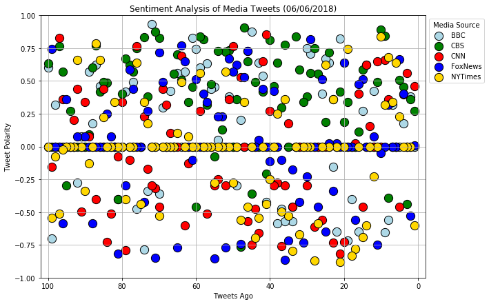
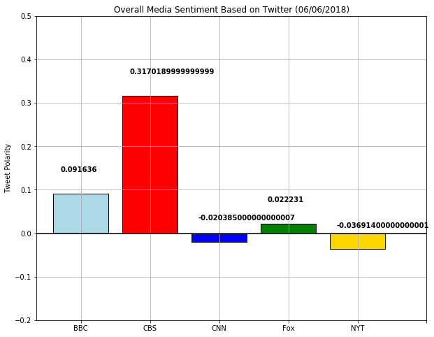

## News Mood

### Analysis

•	OBSERVED TREND 1: It seems the New York Times and Fox News have slightly negative twitter score along with some nuetral VADER scores.

•	OBSERVED TREND 2: The news rest heavily on what is being broadacast the day the analysis is being made, so it doent surprise that majority of the Media Sources are Neutral. 

•	OBSERVED TREND 3: CBS had an overall positive Vader score at .3.


```python
# Dependencies

import tweepy
import json
import pandas as pd
import numpy as np
import time
from datetime import datetime
import matplotlib.pyplot as plt
import seaborn as sns

# Import and Initialize Sentiment Analyzer
from vaderSentiment.vaderSentiment import SentimentIntensityAnalyzer
analyzer = SentimentIntensityAnalyzer()

# Twitter API Keys
from config import (consumer_key, 
                    consumer_secret, 
                    access_token, 
                    access_token_secret)

# Setup Tweepy API Authentication
auth = tweepy.OAuthHandler(consumer_key, consumer_secret)
auth.set_access_token(access_token, access_token_secret)
api = tweepy.API(auth, parser=tweepy.parsers.JSONParser())
```

### Generate Media Tweets


```python
# Variables for holding sentiments
sentiments = []

# Target Account
target_medias = ("@CBS", "@BBC", "@CNN", "@FoxNews", "@NYTimes")

# Variables for holding sentiments
sentiments = []

# Counter
counter = 1

for media in target_medias:
        public_tweets = api.user_timeline(media, count = 100)
        num_tweets = 1

    # Loop through all tweets 
        for tweet in public_tweets:
            print("Tweet %s: %s" % (counter, tweet["text"]))
            
        
        # Run Vader Analysis on each tweet
            results = analyzer.polarity_scores(tweet["text"])
            compound = results["compound"]
            pos = results["pos"]
            neu = results["neu"]
            neg = results["neg"]
            tweets_ago = num_tweets
        
        # Add sentiments for each tweet into a list
            sentiments.append({"Media Source": media,
                            "Date": tweet["created_at"], 
                           "Compound": compound,
                           "Positive": pos,
                           "Negative": neg,
                           "Neutral": neu,
                           "Tweets Number": num_tweets,
                           "Text": tweet["text"]})
        
        # Add to counters 
            counter +=1
            num_tweets +=1
```

    Tweet 1: Don’t miss a special performance from @springsteen this Sunday at the #TonyAwards: https://t.co/LYYdleaFwU https://t.co/IKkKoITH9y
    Tweet 2: RT @CBSThisMorning: .@SaraBareilles and @joshgroban are hosting this Sunday's @TheTonyAwards on @CBS! 
    
    Wednesday, they'll join us LIVE on…
    Tweet 3: RT @SU2C: SU2C telecast Co-Executive Producer Bradley Cooper sits down with Mitch Carbon, a pediatric cancer survivor who benefited from #S…
    Tweet 4: RT @StrangeAngel: About last night... The #StrangeAngel screening party was a blast! Pun intended. 🚀😏 https://t.co/m64EcNmweY
    Tweet 5: These CBS stars can really belt it out! Find out which celebs from your favorite shows are pitch-perfect:… https://t.co/X4zMACFazB
    Tweet 6: More stars are set to appear at the #TonyAwards, including @billyjoel, @amyschumer, and @katharinemcphee. See who e… https://t.co/lPUocBcn9t
    Tweet 7: The #TonyAwards are just days away, and @joshgroban and @SaraBareilles will bring all they've got to Broadway's Big… https://t.co/eKkWn6ClSq
    Tweet 8: Call us old-fashioned, but we donut want you missing out on #NationalDonutDay! Here are a few treats from us to you… https://t.co/HpzN8bQ3SO
    Tweet 9: Remember @Lin_Manuel’s beautiful sonnet from the 70th Annual Tony Awards®? Relive some of the greatest moments in… https://t.co/IZjeQLd58C
    Tweet 10: Good friends @joshgroban and @SaraBareilles are hosting the #TonyAwards together? Well, this is bound to be fun! https://t.co/26Vgzp0s2e
    Tweet 11: The #TonyAwards just got even better because @UzoAduba, @MattBomer, and more stars will be presenting live! Find ou… https://t.co/hfFBtWo1T9
    Tweet 12: Mark your calendars. @SalvationCBS returns Monday, June 25 at 9/8c! ☄️ https://t.co/N9pYuhYLRF
    Tweet 13: RT @thegoodfight: All episodes of season 2 are now available. Stream #TheGoodFight on CBS All Access: https://t.co/k3tn8kR9KC https://t.co/…
    Tweet 14: Get the popcorn ready! 🍿  It's going to be an unforgettable @survivorcbs finale. Make sure to tune in TONIGHT at 8/… https://t.co/vp0JyqfXMQ
    Tweet 15: RT @StrangeAngel: Every brilliant mind has a dark side. #StrangeAngel launches June 14, only on CBS All Access. https://t.co/y0MZg1BzEB htt…
    Tweet 16: Prepare yourself. The @NCIS_CBS season finale is unlike any other. Don't miss it TONIGHT at 8/7c. https://t.co/MOH6uiFc0C
    Tweet 17: Summer heats up with @CBSBigBrother, @SalvationCBS, and the brand-new competition series @TKOCBS. Find out when you… https://t.co/DxE7OnKs17
    Tweet 18: Who’s going to be watching the season finale of @ManWithAPlan tonight? RT if you'll be tuning in at 8:30/7:30c! https://t.co/ARLRtVuGuc
    Tweet 19: The season finale of @MadamSecretary will leave you speechless! Make sure to tune in tonight at 10/9c. https://t.co/hqxkLZsWpl
    Tweet 20: The @NCISLA season finale is going to be a wild ride. Don't miss all of the action starting TONIGHT at 8/7c! https://t.co/PNtUuVf9VQ
    Tweet 21: Retweet if you're ready for the #RoyalWedding! https://t.co/k57NM7OrXn
    Tweet 22: It's going down (literally) on the Season Finale of @HawaiiFive0CBS when a submarine appears off the coast of Waiki… https://t.co/oD7Le5XUz6
    Tweet 23: The #RoyalWedding is finally here, and you're invited! Join @CBSThisMorning’s @GayleKing and @etnow’s @KevinFrazier… https://t.co/Q5xiRkXLUz
    Tweet 24: When the @LifeInPiecesCBS season finale is back-to-back episodes. 👏 Get ready for double the laughs at 9/8c! https://t.co/SYW5UzXobv
    Tweet 25: Rules were made to be broken.💥 Don't miss the heart-pounding season finale of @swatcbs TONIGHT at 10/9c! https://t.co/NXLbeIrvcp
    Tweet 26: Is it fall yet? Check out the first looks at our new fall shows and stars from the CBS Upfront!
    
    https://t.co/l7GQVRzRFw
    Tweet 27: How many shows can you binge in a month? Find out with a 1 month free trial of CBS All Access! Use code STREAMITALL… https://t.co/yccQppCaxC
    Tweet 28: Save the dates! The CBS Fall lineup is here, and we're welcoming six new shows in addition to returning hits. Which… https://t.co/f9PSQfpHL7
    Tweet 29: What happens when the friendliest guy in the Midwest moves his family next door to a not-so-friendly new LA neighbo… https://t.co/KtEoNE3deL
    Tweet 30: When @MurphyBrownCBS returns to the news world, things sure won't be what they used to be! The revival of the groun… https://t.co/jJcgyqyDxL
    Tweet 31: When decorated former Navy SEAL Thomas Magnum returns home to Hawaii, he embarks on a new mission: solving cases in… https://t.co/6n2MWY3c2f
    Tweet 32: The ordinary turns extraordinary for this suburban couple when an exuberant young pop star unexpectedly moves in wi… https://t.co/9xaAUSm5nm
    Tweet 33: An outspoken atheist's life takes a surprising turn when he accepts a social media friend request from God! Watch w… https://t.co/EbVbL0SNDk
    Tweet 34: When danger threatens the nation, these elite agents risk their lives to keep it safe. Join them on the case when n… https://t.co/LuSY0jXBf9
    Tweet 35: Meet the new shows coming to CBS this fall!
    Tweet 36: So much TV to love! ❤️ Be sure to follow the shows of the CBS 2018-2019 primetime lineup and stay up-to-date on the… https://t.co/lQwGtznj5i
    Tweet 37: Every mission leaves its mark. Join us in the final mission to avenge Echo Team's deaths, tonight at 9/8c during th… https://t.co/SlfprTVDgD
    Tweet 38: Get ready for three new comedies, five new dramas and the return of the critically acclaimed @MurphyBrownCBS. Here'… https://t.co/alHwUTRFKh
    Tweet 39: RT @happytogether: When an international pop star moves into your house, life gets a little more interesting! @wayansjr, @AmberoniStevens a…
    Tweet 40: RT @TheNeighborhood: You can’t pick your neighbors, but Calvin sure wishes he could! @CedEntertainer stars in the new comedy #TheNeighborho…
    Tweet 41: Tonight's the night - Agent Dwayne Pride's fate will be revealed. Don't miss the special two-hour season finale of… https://t.co/52amkSiNcA
    Tweet 42: Donuts down, hands up! Get ready for a dramatic turn on the finale of @SuperiorDonuts TONIGHT at 9/8c. 🍩https://t.co/f5VSqOlRYu
    Tweet 43: RT @MagnumPICBS: Thomas Magnum is back on the case! @jay_hernandez stars in #MagnumPI, coming to #CBS. https://t.co/R1aURqMawD
    Tweet 44: RT @GodFriendedMe: You never know who's going to send you a friend request. #GodFriendedMe, the new drama series starring @hall_m_brandon a…
    Tweet 45: RT @TheRedLineCBS: Three Chicago families’ lives converge in the wake of a mistaken shooting. From acclaimed producers @ava and @GBerlanti…
    Tweet 46: RT @FamCBS: No family is perfect, especially this #FAM! @ninadobrev, @toneBell and @odessaadlon star in the new #CBS comedy #FAM. https://t…
    Tweet 47: RT @TheCodeCBS: Their code is honor, courage and commitment. They pursue military justice at home and abroad. #TheCode coming to #CBS. http…
    Tweet 48: RT @FBICBS: Meet the FBI agents who are investigating the most dangerous cases threatening our nation. From Emmy Winner Dick Wolf and the t…
    Tweet 49: RT @MurphyBrownCBS: The ground-breaking comedy returns. #MurphyBrown coming to #CBS. https://t.co/di8GXoVPjh
    Tweet 50: RT @StrangeAngel: Play with fire. 🔥 #StrangeAngel launches June 14 on #CBSAllAccess. https://t.co/xiFSkVz1vB https://t.co/Aw3kGeHyj4
    Tweet 51: Happy #MothersDay to the moms who comfort us, understand us, and keep us centered. We ❤️ you. https://t.co/4YDmZrTGIC
    Tweet 52: The more the merrier! CBS has ordered five more shows that just might become your new favorites next season:… https://t.co/2g5OSj2xPu
    Tweet 53: Thinking about the @BlueBloods_CBS season finale like… Don’t miss the surprising reveal TONIGHT at 10/9c. https://t.co/8ExkPFpnFj
    Tweet 54: Double the @MomCBS, double the fun! Anyone else feel like they hit the jackpot with the back-to-back Season Finale… https://t.co/ebq8WJLKGf
    Tweet 55: 2 suitors, 1 Meemaw and 1 Sheldon. You won’t want to miss the season finale of @YoungSheldon tonight at 8:30/7:30c. https://t.co/Hht2yRE7ly
    Tweet 56: Broadway's Biggest Night is around the corner! Who are you hoping to see? #TonyAwards2018 ✨ https://t.co/KLT8QCxWcK
    Tweet 57: The big day is finally here, and you’re invited. 👰 Make sure to tune in to the @bigbangtheory’s star-studded #ShAmy… https://t.co/la9E6tvQ5b
    Tweet 58: Before the #ShAmy wedding tomorrow, the @bigbangtheory stars &amp; special guests play a game of "yay or nay" with thes… https://t.co/ZpCM16qOyT
    Tweet 59: Get ready for more laughs! Learn more about the two new comedies coming to CBS: https://t.co/cpT3fd2RH5 https://t.co/NGrcp803zW
    Tweet 60: Goodbyes are never easy.  After 15 seasons, don’t miss Abby’s final episode of @NCIS_CBS tonight at 8/7c.  https://t.co/GTGj2YRJA1
    Tweet 61: Will you be watching the @BullCBS Season 2 Finale tonight at 9/8c? RT if your answer is yes! https://t.co/OxnyEDVsKj
    Tweet 62: RT @thegoodfight: Listening to #QueenBaranski read fan tweets is like poetry. 😍 Warning: this video will give you ALL the feels. ☺️❤️ #TheG…
    Tweet 63: RT @KevinCanWaitCBS: Season 2 of #KevinCanWait comes to a close tonight, and @KevinJames and @LeahRemini have A LOT to say about it. https:…
    Tweet 64: Spend your Friday night with this dynamic duo! Tune in to the season finale of @MacGyverCBS at 8/7c on CBS and CBS… https://t.co/AfWUVo4GSu
    Tweet 65: RT @undercover_cbs: Get ready for the series premiere of #CelebrityBoss in just seven days! How would you react if your favorite celebrity…
    Tweet 66: The force is strong on the set of @bigbangtheory! #MayThe4thBeWithYou https://t.co/uYyXKtuVCM
    Tweet 67: RT @thegoodfight: The fight's not over yet. #TheGoodFight is renewed for Season 3. https://t.co/gUrDeA5KQP
    Tweet 68: RT @TKOCBS: Both @hwventure and @janemun have been named Executive Producers and showrunners of #TKO: TOTAL KNOCK OUT! Learn more about the…
    Tweet 69: RT @StrangeAngel: Sex. Magick. Rocket Science. #StrangeAngel launches June 14, only on CBS All Access. https://t.co/I3sqWMASxl https://t.co…
    Tweet 70: Broadway's Biggest Night will honor the best in theatre on Sunday, June 10! Here are the nominees for the… https://t.co/tCiNaLGIvq
    Tweet 71: We congratulate all of our CBS #DaytimeEmmy Award winners! Check out the stars who joined @TheTalkCBS hosts to cele… https://t.co/JfUFINmYGH
    Tweet 72: RT @KevinJames: Getting the band back together @AdamSandler @chrisrock @MikeDelguidice1 @KevinCanWaitCBS #KevinCanWait https://t.co/Mo5EWck…
    Tweet 73: See all of the stunning fashion looks from the @CBSDaytime stars on the #DaytimeEmmys red carpet:… https://t.co/iJN1ssGPvZ
    Tweet 74: The 45th annual #DaytimeEmmys are here! Congratulations to all of the wonderful @CBSDaytime stars and shows nominat… https://t.co/xZhDSYnxL6
    Tweet 75: These stars are going undercover for #CelebrityBoss! Find out more about Celebrity @undercover_cbs premiering May 1… https://t.co/Deyn76ADT9
    Tweet 76: New courage. New hope. New season. 
    
    Season 3 of @CodeBlackCBS premieres TONIGHT at 10/9c on CBS! https://t.co/rR8xUCKlzI
    Tweet 77: Celebrate #DNADay by letting your forensic flag fly and revisit some classic episodes of @CSI_CBS on CBS All Access… https://t.co/YCbHDK2r4b
    Tweet 78: Get ready for big reveals, dramatic conclusions, and huge guest stars! Find out more about the 2017-2018 season fin… https://t.co/xcBChnjEvH
    Tweet 79: Who’s ready to see these moves? 🕺 Tune in to the @latelateshow’s Carpool Karaoke Primetime Special TONIGHT at 10/9c! https://t.co/gjrURqXaPN
    Tweet 80: The 53rd #ACMawards turned into one big party when @KeithUrban and @juliamichaels performed their upbeat single "Co… https://t.co/Q3Zj3EzuNs
    Tweet 81: A blind date was all it took. Learn more about Meghan Markle and her road to royalty from the people who know her b… https://t.co/fEAMUblPQ4
    Tweet 82: RT @carrieunderwood: ICYMI! Watch Carrie’s performance of #CryPretty from the #ACMawards below! -TeamCU https://t.co/T9I3ko2xFu
    Tweet 83: There's a new addition to the cast of the upcoming revival of Murphy Brown!  Learn more about Tyne Daly's character… https://t.co/ijSXSLyDaR
    Tweet 84: Country superstar @LukeBryanOnline delivers his moving anthem "Most People Are Good" at the 53rd #ACMawards:… https://t.co/GhhAsEDqmq
    Tweet 85: Coming to CBS All Access June 14, #StrangeAngel is inspired by the real life story of Jack Parsons and explores the… https://t.co/IsPrXRNXye
    Tweet 86: When you realize there are TWO episodes of @CrimMinds_CBS tonight! 👏 Who’s ready for the double-episode season fina… https://t.co/CWVAHHeIGr
    Tweet 87: Giving you even more reasons to celebrate! 🎉 See which CBS series are back for another year: https://t.co/O2LI0eJXTA https://t.co/H436kL1jSK
    Tweet 88: Watch country star @blakeshelton belt out his beautiful ballad "I Lived It" at the 53rd #AMCawards:… https://t.co/w0WRmpQ6fk
    Tweet 89: RT @joshgroban: I AM SO HAPPY I COULD CRY BUT ITS MIDNIGHT IN JAPAN SO I WILL SLEEP BUT ‼️‼️‼️‼️👫🏆🎭😭🔜 #TonyAwards2018 https://t.co/NLss47K6…
    Tweet 90: Broadway stars @SaraBareilles and @joshgroban will host @TheTonyAwards on June 10! Hear how these multi-talented ar… https://t.co/jy52FKd7t0
    Tweet 91: Can you believe it’s been 11 years since @taylorswift13’s first-ever performance at the #ACMawards?! Look back at t… https://t.co/QHSPuJLLFb
    Tweet 92: Waiting for the @ScorpionCBS season finale to start like… Tune in at 10/9c! https://t.co/peoDXtO707
    Tweet 93: Cast your vote! #ACMawards https://t.co/57ZN5gr6Y1
    Tweet 94: RT @CBSTweet: #CBSRatingsNews: #ACMawards Dominate on #CBS.  Over 12 million Total Viewers.  +11% year to year increase!  Biggest audience…
    Tweet 95: In case you missed it, watch the entire #ACMawards now: https://t.co/P3pgMJE2oh https://t.co/OOG2R0Mb4J
    Tweet 96: Relive a night of all-star country music performances and epic wins at the #ACMawards. Stream the entire show:… https://t.co/iA3SMVIhpA
    Tweet 97: Multiple ACM Award Winners @KeithUrban and @carrieunderwood just added one more trophy to their collection with the… https://t.co/rMGCzOeJQK
    Tweet 98: That's a wrap for the 53rd #ACMawards! 🎬 https://t.co/jM0HKud3d6
    Tweet 99: To all of tonight's nominees, we tip our hats to you! 🤠 #ACMawards https://t.co/eytEezfIgS
    Tweet 100: Retweet if you think @carrieunderwood looks beautiful tonight! #ACMawards https://t.co/sqefiLBcXd
    Tweet 101: Tonight, award-winning writer Jeanette Winterson asks what we can learn from the Suffragette movement of a century… https://t.co/K9P2GuRy7X
    Tweet 102: Comedian @JordBrookes joins @SusanCalman for #MrsBrightside - her brand new podcast about mental health from the po… https://t.co/nIvQ5c2NNT
    Tweet 103: Tonight, #OurGirl actress @michkeegan uncovers some exceptional women on her family tree. 🙋💕
    
    Who Do You Think You… https://t.co/HDwdTyTqIw
    Tweet 104: No leaks (and better orgasms) - what you need to know about your pelvic floor. https://t.co/m8pGrbm71M
    Tweet 105: 74 years on from D-Day, these infrared photos show WW2 bunkers in new light. 📷 
    https://t.co/Dn2XKQ5jtZ https://t.co/Rqm91pIfj4
    Tweet 106: There are more than 110,000 gang members in Honduras and they're tearing the country apart. https://t.co/ZF9M0iAvzb
    Tweet 107: From a French novel about the Burundi genocide to a Chilean mystery: add these titles to your book shelf this month… https://t.co/T9AG8kvoPG
    Tweet 108: RT @BBC_ARoadshow: Fiona discovers more about suffragette Emily Wilding Davison, who died after throwing herself in front of the King's hor…
    Tweet 109: Ethan Hawke relives the time when one of his co-stars DIED on stage. #TheGNShow
    
    https://t.co/XIG2Y8OA7m
    Tweet 110: In 1993, Steven Spielberg's film Jurassic Park defined dinosaurs for an entire generation... but does it make scien… https://t.co/wLK4pyl9pv
    Tweet 111: RT @BBCSpringwatch: Ever heard a beatboxing starling? 🔊 🔊
    
    #Springwatch https://t.co/NC52eJ4MX0
    Tweet 112: RT @bbcthree: Madame Poole has been ballet dancing for an astounding seven decades. #HearHer https://t.co/X6ltLoANl7
    Tweet 113: RT @BBCTwo: What if @BBCSpringwatch did #LoveIsland...? 💚😂 https://t.co/V7loYt8gpl
    Tweet 114: RT @BBCFOUR: Here's a sneak preview of our brand new drama #Hidden. Starts Saturday, 9pm, @BBCFour. https://t.co/cibPD1hzr3 https://t.co/te…
    Tweet 115: When Mona began to lose her sight, her 84-year-old husband did something amazing for her... 💅💄❤️️
    
    https://t.co/Qle1eoBU5x
    Tweet 116: We're all familiar with that sinking, nagging feeling we get when we realise we have made the wrong choice. 😟
    
    But… https://t.co/NPYZY5U43f
    Tweet 117: 📻🐫🦅🐼🦈 @GregJames has got a new co-host!
    
    Sir David Attenborough becomes a @BBCR1 DJ at 5pm today... 
    
    https://t.co/zHHtjBZZ9v
    Tweet 118: 'The problem with plastic is that it never goes away. It doesn't decompose. It defies nature.' 
    #WorldEnvironmentDay https://t.co/Tkmj9qXzlK
    Tweet 119: #OurGirl is back and heading to Nigeria in the fight against terror. 
    
    Our Girl | 9pm | @BBCOne |… https://t.co/epbhcujexD
    Tweet 120: 👶🥦 If your child's a fussy eater, here are 5 tips from scientist @Dr_C_Llewellyn. https://t.co/MOhdgXa96t
    Tweet 121: RT @BBCTwo: Always wanted to pitch an idea to the stars of #DragonsDen? Well here’s your chance! Reply to this tweet with your best busines…
    Tweet 122: 💔 Fashion designer Kate Spade, 55, has been found dead in her New York apartment.
    👉 https://t.co/ku2uHiO0Nh https://t.co/sg40Mjbb12
    Tweet 123: ♻️🗑 These protesters want shops to take more responsibility for the overuse of plastic packaging.… https://t.co/C4YX62DYWU
    Tweet 124: ❤️😽 This man has vowed to be the best 'cat dad' he can be after finding random kittens under his bed. 
    👉… https://t.co/fWsKzfv8s3
    Tweet 125: 😂 These knitted Poldark dolls are the best!
    #TheGNShow https://t.co/Mpc1dWzojg
    Tweet 126: RT @BBC_ARoadshow: From artists to explorers, suffragettes to swimmers #antiquesroadshow discovers the pioneering women who have help shape…
    Tweet 127: How does plastic actually enter our oceans? 
    #WorldEnvironmentDay https://t.co/LdOt9inVFS
    Tweet 128: RT @BBCBreakfast: Have you got yours yet? #gingeremoji https://t.co/hKwIsLspYC
    Tweet 129: RT @bbcthree: 17-year-old Dillon upcycles clothes to help young homeless people feel confident going to school or for job interviews. https…
    Tweet 130: RT @BBCNews: "I was disabled before it was popular."
    
    @LostVoiceGuy - aka Lee Ridley - is the first comedian to win Britain's Got Talent.…
    Tweet 131: 🎨🙌 Middle-earth in colour: How Tolkien drew his fantasy universe.
    👉 https://t.co/z754byqVpR https://t.co/Jr6PnQWvIU
    Tweet 132: It's time to think about our plastic behaviour.
    #WorldEnvironmentDay https://t.co/kSzSawpYLv
    Tweet 133: Some of Arthur C Clarke's predictions about the future were bang on... https://t.co/6M7UJv6Mmh
    Tweet 134: 📎 The psychology of stealing office supplies. 
    👉 https://t.co/vfXaRVYcwU https://t.co/zoPWJRXVtO
    Tweet 135: 💤 Ever wondered what your brain is up to while you're dreaming? https://t.co/2JHc0lFKbS
    Tweet 136: Versailles is back! Tonight, Madame de Montespan finds out how to hurt a former friend...  
    
    #Versailles | 9pm |… https://t.co/5nEGyPoAp6
    Tweet 137: The story of a group of working-class women conducting a dangerous campaign for the vote.
    
    Suffragettes with… https://t.co/RKwQbGQMdu
    Tweet 138: The moment a dancing off-duty FBI agent drops his gun performing backflip and accidentally shoots man in leg. https://t.co/FIu2mCjlyP
    Tweet 139: 📸 From #Manhattanhenge to the world's largest freshwater pearl, here are some of the most striking news photos take… https://t.co/5Tp0s3MG7n
    Tweet 140: 🤷‍♀️😂 When @CubaGoodingJr took over @BBCBreakfast.
     https://t.co/XSPs0MOKoN
    Tweet 141: 🧔 Bearded men have been taking pictures of themselves from below and it's freaking people out...
    👉… https://t.co/FQ9t0swX2t
    Tweet 142: RT @bbcdoctorwho: Every episode of #DoctorWho since 2005 is now available to watch on @BBCiPlayer… Enjoy! https://t.co/uNWq307bei https://t…
    Tweet 143: ❤️ Ethan Hawke will be forever grateful to Robin Williams for helping launch his career.
    #TheGNShow https://t.co/uYMvKQvuev
    Tweet 144: Would you describe yourself as a feminist?
    
    #HearHer https://t.co/4UZzAu2IRO
    Tweet 145: RT @BBCSpringwatch: Surely this is the only way to react to chicks fledging?! 😂 We sure are excited here at #Springwatch HQ! 
    
    Thanks for c…
    Tweet 146: 💡 Brilliant idea! 
    
    Plastic waste is being being recycled in to amazing furniture. https://t.co/cb0lSVhAFX
    Tweet 147: 📚 Every story in the world has one of these six basic plots. 
    👉 https://t.co/eoZXHpOX4q https://t.co/YC6oLjIn1O
    Tweet 148: 📸🦊 This photographer captures foxes in their most natural of habitats - the darkness. https://t.co/bkNUknwSAC
    Tweet 149: RT @BBCTwo: Here's why @MrNishKumar wants The Spice Girls to stop right now. 😂 #LiveAtTheApollo https://t.co/Beqy2kfFah
    Tweet 150: A documentary about the trial of Jeremy Thorpe, which has remained unseen for nearly 40 years. 
    
    The Jeremy Thorpe… https://t.co/jLEcBHG1Cx
    Tweet 151: Comedian @frankieboyle is heading to Russia before the World Cup tournament begins. 
    
    Frankie Goes to Russia | 9pm… https://t.co/moLB9EGm1Q
    Tweet 152: Meet the bees who make their own cologne! 🐝🇲🇽
    
    https://t.co/wGqJoNINS2
    Tweet 153: 🦁 Be a zoo keeper for the day
    🚲 Ride a bicycle made for two 
    🦈 Swim with sharks 
    
    An eight-year-old boy has created… https://t.co/PkrSoRzoXB
    Tweet 154: 🦋🏰🎥 Lotte Reiniger, a forgotten pioneer of animation, was the first person to create an animated feature film in co… https://t.co/GKBkpKVFjt
    Tweet 155: 💍❤️ Guess that's a yes!
    https://t.co/xLR4N7qtaZ
    Tweet 156: Cow cuddling is the new wellness trend coming to a field near you... 🐮💕 https://t.co/jEwRFBzUJe https://t.co/zUzKHQ69oU
    Tweet 157: RT @BBCOne: This audience member made Aidan Turner his own knitted Poldark doll - and it's so cute! #TheGNShow https://t.co/94h7BfhoPk
    Tweet 158: The one and only Jeff Goldblum reveals how to do 'the look' that every Jurassic Park actor does when they first see… https://t.co/H8dOEmsDMr
    Tweet 159: These beautiful black and white photographs of London remained hidden in a loft for 30 years before they were disco… https://t.co/F4PDR8kW81
    Tweet 160: The Queen loves the Highland pony and has set up a breeding programme to ensure they continue to survive. ❤️ 
    
    Coun… https://t.co/S7fUN1WmK0
    Tweet 161: These adorable baby hares snuggle together for warmth and comfort. 🐰💕
    https://t.co/LgJsY4XuHD
    Tweet 162: This incredible cafe is run by teenagers with autism. ☕️🍰🥪
    
    https://t.co/D6HJgLYXxa
    Tweet 163: Intuition has fallen out of favour in an age of rational, analytical thinking. But should you still trust your gut?… https://t.co/pl8SydpXfy
    Tweet 164: Remembering the people of Bunce Island, who were sold into the British slave trade. 
    
    https://t.co/HV5AWuWA29
    Tweet 165: RT @bbcweather: Today will be fine and warm with plenty of sunshine for the majority of the country apart for an isolated heavy shower. Sco…
    Tweet 166: Women are more likely to wait longer for a health diagnosis and to be told it’s ‘all in their heads’.
    👉… https://t.co/9u3Pb6hQpT
    Tweet 167: A once-in-a-lifetime conversation with Eileen Atkins, Judi Dench, Maggie Smith and Joan Plowright. ✨
    
    Nothing Like… https://t.co/JxH075mKLm
    Tweet 168: Not long to go now...⚽️
    
    #HistoryWillBeMade https://t.co/Q2BX0nK5vg
    Tweet 169: A project to provide free sanitary products to women from low income households in Aberdeen is to be rolled out acr… https://t.co/wfdK5nWCsC
    Tweet 170: 🍽️🤣 When you’re too polite to complain. https://t.co/CrzNNixuaY
    Tweet 171: 🌏💫 13.8 billion years of our universe's history packed into four minutes. https://t.co/EBGmVry69j
    Tweet 172: RT @BBCShakespeare: Turns out even #Shakespeare acting legends love a good get together. 🎭 Tag those special friends you share everything w…
    Tweet 173: Anthony Hopkins. Emma Thompson. William Shakespeare...
    
    👑 It really doesn't get much better than this.  
    #KingLear https://t.co/wQBYFQIIlf
    Tweet 174: 📱 Are health apps actually bad for your health?
    
    'The danger is when we reduce our self-worth to a number.'
    👉… https://t.co/AOWkdvf3TY
    Tweet 175: RT @BBCSpringwatch: BREAKING NEWS! 🚨
    
    Our wrens have started to fledge the nest 😍 Stay up to date at https://t.co/gIA23qZAHX
    #Springwatch h…
    Tweet 176: In 1966, a group of schoolchildren made some sad and uncannily accurate predictions about the future. https://t.co/gNGkpeyoZ9
    Tweet 177: 🤔👔 This men's T-shirt shirt is selling for £935 and it's left loads of people pretty baffled.
    👉… https://t.co/yONjwKqdkz
    Tweet 178: 🦆 Swans have been borrowing items from @SteveBackshall to build their nests for the last few years.  https://t.co/d5S5PG9Ygi
    Tweet 179: 📸🐶 Call the puparazzi, these divas are ready to shine! 💎https://t.co/zYrpgXF69z
    Tweet 180: 🙌❤️ Take us back to @NiallOfficial at #BiggestWeekend.
    
    There's still time to catch up on this incredible set + lot… https://t.co/sP2h8cjgsw
    Tweet 181: RT @bbcmusic: We knew @TaylorSwift13 was trouble when she touched down in Swansea 😅😍
    
    Watch her showstopping @BBCR1 #BiggestWeekend set in…
    Tweet 182: 🎤❤️ #BTS are on the lips and screens of fans everywhere as the #Kpop band smash records in real life and on social… https://t.co/h7KwxeZQm5
    Tweet 183: 😈 Cute...but deadly. https://t.co/lhpd0watrN
    Tweet 184: Leaving work on a Friday like... 👋💃#FridayFeeling @Camila_Cabello https://t.co/oJUssdSPfb
    Tweet 185: 🧠🎞 A film where the plot changes depending on the viewer’s brain activity has been developed. https://t.co/7UCYCO7Xyz
    Tweet 186: RT @BBCScotland: Watch one of Scotland's best-known structures appear from the mist in this stunning timelapse https://t.co/h0mUFTKcmQ
    Tweet 187: RT @bbcgetinspired: Meet the Nawaz family and hear how #SuperMovers is helping them get a better night’s sleep. 
    
    Remember to check out Sup…
    Tweet 188: A natural hair dye based on the blackcurrant waste from the production of Ribena has been created by scientists.
    👉… https://t.co/4e001z6rPc
    Tweet 189: Smithy knows how to celebrate #nationalfishandchipday properly. 😂🍟
    
    https://t.co/FFV75BsW0Q
    Tweet 190: 🌽🍔🌮 Vegan junk food, anyone? 
    #MillionPoundMenu https://t.co/MY5i9Xph5H
    Tweet 191: RT @BBCTwo: Want to learn some quick Swedish and Danish? Here’s the cast of #TheBridge with some everyday phrases you might need… ☠😱 https:…
    Tweet 192: 😢 @NatGeoMag has published a selection of startling photos highlighting the vast amounts of discarded plastic choki… https://t.co/vdjw1nnW36
    Tweet 193: RT @BBCBreakfast: Come on then, who wants to get their hands on the world's largest freshwater pearl? 🙋🙋‍♂️ https://t.co/C0QV5sHSRx
    Tweet 194: 🎶 Won’t you listen to the man that’s… reading you a #BedtimeStory! 
     
    📚 Catch @george_ezra tonight on #CBeebies! https://t.co/mcCzqePrQ7
    Tweet 195: RT @BBC6Music: Which Biggest Weekend sets will you be watching back on iPlayer?
    
    We asked Neneh (@misscherrylala), @Hanpeel, @Franz_Ferdina…
    Tweet 196: This guy is INCREDIBLE 😂
    #Hardball https://t.co/HiI4Uxe5TZ
    Tweet 197: The 1960s counterculture fuelled an artistic explosion in the US – but were the flower children merely privileged?… https://t.co/T81ZRLcQQr
    Tweet 198: Is individualism to be celebrated or lamented? https://t.co/85gs317qM5
    Tweet 199: 'There's nothing a man can do that a woman cannot do'. 
    
    Meet the Nigerian girls fighting out of poverty. 🥊
    
    https://t.co/d0fm8HShEK
    Tweet 200: Did @PanicAtTheDisco's @BrendonUrie just reveal he was almost in The Greatest Showman? 😱🎶
    
    https://t.co/7YXvyrTfHw
    Tweet 201: .@ChrisCuomo challenges White House press secretary Sarah Sanders for repeatedly calling special counsel Mueller's… https://t.co/iO7ujABJcM
    Tweet 202: Speaker company Sonos doesn't have its own voice assistant. Now it is trying to turn that into its biggest selling… https://t.co/YvtKYudbNc
    Tweet 203: Republican lawmakers point to positive signs after California election night https://t.co/XhDN9imEkx https://t.co/IpPU65gmoT
    Tweet 204: "You aren't listening": Philadelphia Eagles star Malcom Jenkins wanted to be heard, so he shared his message by put… https://t.co/3I7iqR9Nem
    Tweet 205: Alice Marie Johnson has been released from prison. President Trump commuted her sentence today after meeting with K… https://t.co/bdPpqx3IS0
    Tweet 206: RT @AC360: “Mr. Giuliani is an absolute pig for making those comments.”
    
    Stormy Daniels’ attorney Michael Avenatti says Rudy Giuliani's der…
    Tweet 207: Here are some key events in the talks between the Trump and Mueller teams https://t.co/FvnNPCv1Wd https://t.co/EqNaJTu7j4
    Tweet 208: Tesla's stock price soared as investors were encouraged by CEO Elon Musk's pledge that Model 3 production has turne… https://t.co/woKx2yOrOJ
    Tweet 209: RT @AC360: "I want to say to President Trump: I am going to make you proud that you gave me this second chance in life."
    
    Alice Marie Johns…
    Tweet 210: “My daughter continues to always tell me I remind her of a phoenix… I guess in order to be a phoenix I had to rise… https://t.co/aLk4zOV2sW
    Tweet 211: Facebook says it has a deal to share user data with Huawei, a Chinese smartphone maker that US intelligence agencie… https://t.co/YczpPvzaDo
    Tweet 212: RT @AC360: “My daughter continues to always tell me I remind her of a phoenix… I guess in order to be a phoenix I had to rise above the ash…
    Tweet 213: What do giant doughnuts and a hot dog as big as a firetruck have in common? They are some of the peculiar buildings… https://t.co/w3PuI5PK5s
    Tweet 214: Alice Marie Johnson to President Trump: "I am going to make you proud that you gave me this second chance in life a… https://t.co/azeC8qVnRd
    Tweet 215: Alice Marie Johnson on leaving prison after Trump commuted her sentence: "I have not been in a car without handcuff… https://t.co/WjZ4McT3qv
    Tweet 216: Polling in the last year has been split half and half on support for players in the NFL kneeling during the Nationa… https://t.co/YszquEzeSf
    Tweet 217: "It was a complete shock. And it clearly wasn't her. There were personal demons she was battling." The husband of f… https://t.co/drurep0qtK
    Tweet 218: US officials have laid the groundwork for President Donald Trump and North Korean leader Kim Jong Un to hold a seco… https://t.co/rb4cTaAb8V
    Tweet 219: The police chief in Mesa, Arizona, says he was "disappointed" by a video that shows officers punching and kneeing a… https://t.co/7GEC34NeNw
    Tweet 220: The maker of Jack Daniel's is worried about the impact of a trade war https://t.co/I7mLyVwwUU https://t.co/y3mxK9Ge0u
    Tweet 221: She was kidnapped by Salvadoran guerrillas three decades ago, watched her husband be killed, and forced to cook and… https://t.co/3uUOoIEH7R
    Tweet 222: EPA Administrator Scott Pruitt on Chick-fil-A: "We need more of them in Tulsa and we need more of them across the c… https://t.co/7E7jP3lbc2
    Tweet 223: The wife of Trump campaign aide George Papadopoulos, who pleaded guilty to lying about his Russian contacts, asks P… https://t.co/XF0h8mEKs8
    Tweet 224: IHOP says it's changing its name to IHOb https://t.co/OMvnRKOUhq https://t.co/4IgRjsHTZH
    Tweet 225: An EPA spokesperson referred to a reporter as a "piece of trash" when the journalist phoned for comment on a story… https://t.co/FRFCwsvwTZ
    Tweet 226: A 64-year-old woman in Australia died after contracting hepatitis A linked to frozen pomegranate seeds, according t… https://t.co/HAGs4p64yJ
    Tweet 227: Zach Wahls, an activist for LGBTQ rights who rose to prominence for a viral speech defending marriage equality and… https://t.co/5Bf6UKiRT1
    Tweet 228: Former NYC Mayor and current Trump lawyer Rudy Giuliani has received a dismal favorability rating, according to a Q… https://t.co/DVNlaKVBXo
    Tweet 229: Apple is getting closer and closer to becoming the first $1 trillion American company https://t.co/JRSmeYd5lT https://t.co/q1PvmCBoJn
    Tweet 230: Senate Republicans have accused the Obama administration of secretly trying to give Tehran access to the US financi… https://t.co/hlBOZ6n70e
    Tweet 231: Dennis Rodman is "considering going to Singapore" for the upcoming Trump-Kim summit, his agent says. The former NBA… https://t.co/d705nzmGhM
    Tweet 232: Former NBA star Dennis Rodman is "considering going to Singapore," for the upcoming summit between President Donald… https://t.co/QC04uVfYN3
    Tweet 233: EPA Administrator Scott Pruitt appeared to confirm recent reports that he looked into the potential of his wife ope… https://t.co/UyKGmTPeOM
    Tweet 234: BREAKING: Alice Marie Johnson has just been released from prison after Trump commuted her sentence. "I'm just so th… https://t.co/umxk4rr455
    Tweet 235: Adult film actress Stormy Daniels has launched a new lawsuit against her former attorney, Keith Davidson, as well a… https://t.co/s841T6wEBs
    Tweet 236: A British man who was credited with stopping a worldwide WannaCry ransomware attack last year faces new federal cha… https://t.co/bxIxE1H2X5
    Tweet 237: How the Democrats avoided disaster in California https://t.co/1Q3QSDPXzE https://t.co/Ujcjyf4EDJ
    Tweet 238: Electric cars could put 100,000 German jobs at risk https://t.co/DSsF1BPcvF https://t.co/MF9OlE8Hfx
    Tweet 239: A federal judge has once again rebuked the administration's efforts to pressure so-called sanctuary cities, going f… https://t.co/KmSqtspmLJ
    Tweet 240: First responders in Russellville, Arkansas, went above and beyond the call of duty to surprise a teen with autism a… https://t.co/ZD2Oc0jUPQ
    Tweet 241: .@ChrisCuomo on NFL anthem controversy: “Unconditional love for this country is expressed in our freedom and our re… https://t.co/eDjorqfCP4
    Tweet 242: A dessert shop employee protected a gay couple from a group of people yelling slurs during Utah's Pride festival… https://t.co/sP7PwrKzTT
    Tweet 243: Fashion designer Kate Spade's suicide spotlights the importance of recognizing the potential warning signs when som… https://t.co/41yI7NzlwA
    Tweet 244: US Immigration and Customs Enforcement officers arrested 114 undocumented immigrants working at an Ohio gardening b… https://t.co/yaqBZp41jI
    Tweet 245: President Donald Trump visited FEMA, but remained mum on a new estimate of the death toll from Hurricane Maria and… https://t.co/KlmNYSf3Rx
    Tweet 246: A Milwaukee police officer stepped on NBA player Sterling Brown's ankle during his arrest and others mocked any pot… https://t.co/XrPrJw85yS
    Tweet 247: In retaliation for the Trump administration announcing tariffs on steel and aluminum imports from Mexico and much o… https://t.co/LVdflRnYUc
    Tweet 248: The Justice Department reaffirmed that Deputy Attorney General Rod Rosenstein would step aside from overseeing the… https://t.co/DgI3CKTkgF
    Tweet 249: General Motors' president Dan Ammann is leaving Lyft's board.
    
    The rideshare firm and GM, once partners, have becom… https://t.co/tgeTp6CR8R
    Tweet 250: A US-North Korea friendship would be a perfect bulwark against China | By S. Nathan Park via @CNNOpinion… https://t.co/LWERhpgXta
    Tweet 251: Tesla's stock price soared as investors were encouraged by CEO Elon Musk's pledge that Model 3 production has turne… https://t.co/01KYLr4tXV
    Tweet 252: European mental health institutions fall "far below the standard," with no single institution meeting all of the st… https://t.co/uXdhv1ekRx
    Tweet 253: RT @CNNOpinion: "Disastrous colonial adventures overseas? Rest assured, we've been doing it for a lot longer than you have. Which is why I…
    Tweet 254: Two of EPA Administrator Scott Pruitt's closest aides have resigned, an official confirms to CNN… https://t.co/zep78TcGVf
    Tweet 255: American companies announced a record $201.3 billion in stock buybacks and cash takeovers in May.
    
    Critics say the… https://t.co/UemVO2UDdb
    Tweet 256: Ex-White House communications director Anthony Scaramucci says "someone had it out" for the White House communicati… https://t.co/mvvRIpXIoN
    Tweet 257: Wells Fargo isn't the only bank where heavy sales pressure led employees to open fake accounts, regulators say… https://t.co/0Lq3VcX1Bv
    Tweet 258: Plane tickets are about to get more expensive https://t.co/62RTwKp7Ld https://t.co/IZ1WGNryw6
    Tweet 259: First responders in Russellville, Arkansas, went above and beyond the call of duty to surprise a teen with autism a… https://t.co/AsHyMnBQy4
    Tweet 260: RT @CNNOpinion: Trump aide Michael Kratsios: The future of American aviation is all about drones https://t.co/SB2MGqhXgA
    Tweet 261: Democratic Rep. Nydia Velázquez is calling for "an independent commission similar to what we had after 9/11" to inv… https://t.co/LXGm56LzOr
    Tweet 262: The clothes of a leading figure in Germany's far-right Alternative for Germany party were stolen while he was swimm… https://t.co/Jmriq1CvIa
    Tweet 263: History according to Trump, War of 1812 edition | Analysis by CNN's Z. Byron Wolf https://t.co/z8fEjVSyrw https://t.co/sIahAp9lVE
    Tweet 264: A middle school gave graduates a gift it hopes they never have to use -- bullet- and stab-resistant ballistic shiel… https://t.co/6kaFkHyJVE
    Tweet 265: 10 headlines that will make you wonder how Scott Pruitt still has a job | Analysis by @CillizzaCNN… https://t.co/aTyZdLu7LK
    Tweet 266: Lava flow evaporated Hawaii's largest freshwater lake within hours https://t.co/WIDroYynU9 https://t.co/JwrD3kzCb0
    Tweet 267: A government watchdog has cleared Interior Secretary Ryan Zinke from improper political activity when he spoke to a… https://t.co/QZ2cAMKmtM
    Tweet 268: National Park Service acting director Paul Daniel Smith apologized to employees in an email for behaving "in an ina… https://t.co/sjPiLUeXvk
    Tweet 269: The Consumer Financial Protection Bureau has effectively dismissed all the members of an outside board that advises… https://t.co/mwZibCPjFs
    Tweet 270: Why people aren't feeling the strength of the economy https://t.co/1Hfu2CyNnx https://t.co/X7MPPZ032t
    Tweet 271: RT @CNNnewsroom: "The American people are not props,"says Ziad Ahmed, a student activist who is calling for Muslims to boycott Trump’s Ifta…
    Tweet 272: The former head of USA Gymnastics exercised his Fifth Amendment right to avoid self-incrimination and declined to t… https://t.co/1pOJJLjD4d
    Tweet 273: RT @CNNnewsroom: Whether or not a person is pardoned "shouldn't be based on which celebrities have access to the President," says Rep. Ted…
    Tweet 274: How Apple, which is currently worth $945 billion and on track to become the first-ever trillion-dollar company, has… https://t.co/n5sQ6hRTyh
    Tweet 275: These unusual-looking concrete houses will be constructed using a 3D printer in Eindhoven, the Netherlands:… https://t.co/6jXo8LlcMI
    Tweet 276: "We thank our great Singaporean hosts for their hospitality." Donald Trump and Kim Jong Un will meet at the Capella… https://t.co/Ab0EaE5Cta
    Tweet 277: From delivery to aviation, Dubai is at the forefront of drone experimentation. Here's a look at what the future hol… https://t.co/q0S1qZFoHp
    Tweet 278: It's hard to remember a time when Starbucks wasn't on every big-city corner and in every US suburban shopping cente… https://t.co/S6lkccOuee
    Tweet 279: British troops burned down the White House during the War of 1812. Historians note the British attack on Washington… https://t.co/da00rwRB2h
    Tweet 280: According to the sources, Trudeau pressed Trump on how he could justify the tariffs as a "national security" issue.… https://t.co/EMylmUA4zt
    Tweet 281: President Trump and Canadian PM Justin Trudeau had a testy phone call on May 25 over new tariffs imposed by the Tru… https://t.co/UEms7CfP5A
    Tweet 282: Republican megadonor and billionaire David Koch is stepping down from his role at Koch Industries and other organiz… https://t.co/C93TWf7bxd
    Tweet 283: Democratic Sen. Dick Durbin says healthcare will be the party's priority for the canceled August recess… https://t.co/9qBZTGZYJI
    Tweet 284: The maker of Jack Daniel's is worried about the impact of a trade war https://t.co/5rEiKMiNBa https://t.co/GfJJhgIgBC
    Tweet 285: Things are a little bit cheaper at Costco, Target, Walmart and Kroger this year thanks to a price war… https://t.co/gGc6Ozrila
    Tweet 286: Steamboat Geyser in Yellowstone National Park is erupting unusually frequently. On June 4, the geyser had its eight… https://t.co/FJhiVtbNli
    Tweet 287: Paul Manafort could be in big trouble | By Paul Callan via @CNNOpinion https://t.co/MPcnd4ekF8 https://t.co/SrLVt49ThU
    Tweet 288: How much longer can the US economy keep rolling? Tune in to @CNNMoney's "Markets Now at 12:45pm ET to see economist… https://t.co/F4oK0zR21U
    Tweet 289: BREAKING: President Trump has commuted the life sentence of Alice Johnson following a White House meeting last week… https://t.co/xLGQ5vvNtQ
    Tweet 290: President Trump says first lady Melania Trump is "doing really well" ahead of her first public appearance since May… https://t.co/mNU2ij342U
    Tweet 291: "It wasn't my finest hour." Former President Bill Clinton says he was mad at himself over his recent comments about… https://t.co/ueAskMrNnD
    Tweet 292: The European Union's top court ruled that same-sex couples are entitled to the same residency rights as other marri… https://t.co/jExDrtdNck
    Tweet 293: House Speaker Paul Ryan says he agrees with Republican Rep. Trey Gowdy that the FBI did "exactly" what it was suppo… https://t.co/Xhbm8kD6MT
    Tweet 294: Watch these homes being built using a 3D printer https://t.co/igaBP4BFwG https://t.co/sGcYS89MDO
    Tweet 295: World Cup 2022: Meet the Qataris making the most of soccer's showcase https://t.co/DjpV7FTj0j https://t.co/stmyDwlsrb
    Tweet 296: Will we ever fly like the Jetsons? This company just unveiled its first commercial flying car, Flyer — and… https://t.co/ch1x4FM5EX
    Tweet 297: Bill Gates is giving 2018 college grads his favorite new book for free https://t.co/vIe4FaQTFq
    Tweet 298: RT @cnni: JUST IN: Dozens of firefighters are tackling a blaze at a hotel in the Knightsbridge area of London https://t.co/ChtVjxJEv5 https…
    Tweet 299: "On a personal level, we can all follow the ethos of the Miss America competition, and make a conscious effort to s… https://t.co/T3LUphyJWN
    Tweet 300: Most Americans say they aren't booking a vacation to space -- except millennials. 63% say they'd be up for it, acco… https://t.co/TQ8Mr0ffOc
    Tweet 301: WOW: Shocked bystanders watched as a stolen armored vehicle led police on a 60-mile chase through Virginia Tuesday.… https://t.co/6lMRRgMkyv
    Tweet 302: Son who wrote viral revenge obituary about his mom explains why he did it. https://t.co/nDgasXd59M
    Tweet 303: .@SeanHannity on the commutation of Alice Johnson: "This is likely just the beginning of what is a long needed conv… https://t.co/NJgae3AEVG
    Tweet 304: .@POTUS hosts the @WhiteHouse iftar for the Muslim holiday of Ramadan. https://t.co/LGiHoC57y9
    Tweet 305: OUT OF THE DIAMOND AND INTO A CUP: A San Diego Padres fan caught a foul ball in her beer, and subsequently chugged… https://t.co/LA2b7l9BN6
    Tweet 306: DOJ tells Graham Rosenstein won't recuse from Mueller probe unless officials deem it necessary https://t.co/E8h9Yp47qc
    Tweet 307: WATCH: D-Day Survivors Recall Invasion of Normandy 74 Years Later https://t.co/DvAKo36FLs
    Tweet 308: Who is Alice Marie Johnson, the great-grandmother Trump is granting clemency to? https://t.co/rzdrSLgrUk
    Tweet 309: Connecticut man cops to trafficking in endangered sperm whale teeth https://t.co/Wh3GnILWLc
    Tweet 310: .@ericswalwell: "Jim @Comey is an imperfect man, all of us are, but imperfect people are still capable of telling t… https://t.co/rTXjiIIm5p
    Tweet 311: Bush airport resumes operation following bomb scare caused by 'impatient' passenger https://t.co/vatbGdFANz
    Tweet 312: Earlier, @SenTedCruz criticized the Obama administration amid reports that it gave Iran access to the United States… https://t.co/0D6jjxEL0u
    Tweet 313: Parkland high school monitor who saw Nikolas Cruz before shooting is barred from grounds. https://t.co/73QghMBEeE
    Tweet 314: 'The Media Is Totally Out of Line': #TheFive Reacts to Rumors About Melania Trump. https://t.co/NcEpDJ7Taj
    Tweet 315: .@FloydMayweather tops Forbes' list as the highest-paid athlete. (via @MRichardson713) https://t.co/RhlxHu0Dz0
    Tweet 316: .@newtgingrich: "I think among Republicans, [@POTUS] is probably the most popular president at this stage of any Re… https://t.co/lYMnsNP6SD
    Tweet 317: UPDATE: Alice Johnson has been released from federal prison after a commutation from @POTUS and lobbying from… https://t.co/N8OORmx43s
    Tweet 318: .@GovMikeHuckabee: "A lot of the people that we're incarcerating, we need to be putting them in treatment centers."… https://t.co/F5lIoT3iQG
    Tweet 319: Sen. @LindseyGrahamSC on Deputy AG Rod Rosenstein and the Mueller probe: "I don't know how you can oversee an inves… https://t.co/c9MOHfaKuc
    Tweet 320: .@JonahNRO on Singapore summit: "I think the best you can get out of this is just to determine whether or not the N… https://t.co/nIzHW12Oyx
    Tweet 321: .@LindseyGrahamSC on the FBI's handling of events surrounding the 2016 election: "We'll see what the [inspector gen… https://t.co/k9pHsbjXHf
    Tweet 322: .@SusanPage on Singapore summit: "I can't imagine that on June 12th they're going to reach a verifiable, in concret… https://t.co/SKiViKKSCF
    Tweet 323: South Carolina prisons using drones to combat contraband deliveries. https://t.co/TF55LNstkH
    Tweet 324: Bumper car catches on fire at North Carolina amusement park https://t.co/gGPRXhTG2e
    Tweet 325: This @GrandCanyonNPS squirrel had no shame in asking a tourist for a quick drink. https://t.co/HkNTcPQgsP
    Tweet 326: Belmont Stakes horses to watch, from Triple Crown hopeful Justify to Gronkowski https://t.co/MphMxG8cg1
    Tweet 327: Trump forced Kim Jong Un to 'beg' for meeting, Giuliani says https://t.co/mcs3ELY43J
    Tweet 328: GERBER BABIES UNITE: One-year-old Lucas Warren, the newest Gerber Baby, recently met with 91-year-old Ann Turner Co… https://t.co/gSCx56Td7v
    Tweet 329: 'A Sanctuary City': Philadelphia Mayor Kenney Dances to Celebrate Court Win Against Trump https://t.co/hzd4V8KVOl
    Tweet 330: .@SenateMajLdr cancels Senate's traditional August recess. @MikeEmanuelFox has the story. #SpecialReport… https://t.co/hTkXhrO9OI
    Tweet 331: South Carolina restaurant manager pleads guilty to enslaving, abusing mentally challenged black worker https://t.co/9dezylDRSC
    Tweet 332: OPINION: California breaks Democrats' hearts: 'Big, blue shutout' fails and other takeaways from Tuesday's primaries https://t.co/8mub9U2SiW
    Tweet 333: .@JesseBWatters on @BillClinton: "Only a Democrat can get a do-over in the mainstream media." #TheFive… https://t.co/NqSSKZoJNC
    Tweet 334: Missouri men bound, set woman on fire when she refused to give combination to safe, police say. https://t.co/3pzD9sf6s1
    Tweet 335: Severed rattlesnake head bites Texas man, nearly kills him. https://t.co/wlq7vCuvXJ
    Tweet 336: Kim Jong Un is terrified someone will kill him at the Singapore summit, report says
    https://t.co/CSRoHfKShI
    Tweet 337: 'Highly partisan' Mueller team is trying hard to 'frame' @POTUS, Giuliani says in Israel.
    https://t.co/l1HOa4rGAl
    Tweet 338: .@greggutfeld on the upcoming North Korea summit. https://t.co/Vio4w2SKAj
    Tweet 339: .@kimguilfoyle: "If ultimately the goal gets achieved, and they accomplish something, and they're able to denuclear… https://t.co/oUcoa9g03C
    Tweet 340: It wasn't the McCain joke, but the subsequent response, that cost former White House aide Kelly Sadler her job. https://t.co/OpuFc1wyED
    Tweet 341: Stormy Daniels sues her former lawyer, says he became 'puppet' for Trump  https://t.co/nHQaf4Kpwc
    Tweet 342: .@RandPaul: "Trade is largely beneficial to this country and one of the things that people misinterpret is they tal… https://t.co/SPUm7nZE5q
    Tweet 343: Manchin says he regrets Clinton support, could back Trump in 2020 https://t.co/YnAQ7C97PV
    Tweet 344: .@RandPaul on NK summit: "I think it's a mistake to start using national security wavers to invoke tariffs on allie… https://t.co/ijkws6eDsJ
    Tweet 345: RT @FoxBusiness: #StockAlert: The Dow Jones Industrial Average ends at session highs; New record closes for Nasdaq and Russell 2000 for the…
    Tweet 346: Rep. Daniel Webster: Trump takes action to improve veterans’ health care https://t.co/iC58PQY27p
    Tweet 347: .@IHOP says it's changing iconic name; pancake lovers flip out https://t.co/9qLNy1GLlV
    Tweet 348: .@AshWebsterFBN on tariffs: "We're prideful now that we're finally firing back in a trade war that's gone on for de… https://t.co/3d6oza3Ohv
    Tweet 349: Mark Penn: "These tariffs go right to the sweet spot of Indiana through Pennsylvania. And so it's important that De… https://t.co/tcDOGNRA5i
    Tweet 350: .@cvpayne on G7 summit: "The markets certainly sense that @POTUS is gonna get something huge here...We're in a hot… https://t.co/aSoHGpf2XD
    Tweet 351: Stocks surging despite trade war fears. @TeamCavuto https://t.co/mbiIkoLFHd https://t.co/8RfpLQbU0g
    Tweet 352: President @realDonaldTrump to meet with leaders of Europe and Canada amid fears of trade war. @BlakeBurman has the… https://t.co/PSSPvwHvAa
    Tweet 353: Lobbying for Trump pardons hits a fever pitch https://t.co/jkBHaPk1I1
    Tweet 354: Bill to allow importing of exotic animals for hunting shut down by Rhode Island lawmakers. https://t.co/wNHPrL0sQM
    Tweet 355: Four ISIS terrorists are dead after U.S. airstrikes in Libya today. @ShepNewsTeam https://t.co/ScC3r7H6tS
    Tweet 356: Investigators in Virginia say a soldier was on drugs when he stole an armored vehicle and led police on a chase for… https://t.co/OTsagIHek6
    Tweet 357: OPINION: Dear Kate Spade: Your handbags (and earmuffs) brought us so much joy -- I'm sorry you were so sad https://t.co/lYmrQZwkAk
    Tweet 358: Congressional letters obtained by Fox News show that former FBI Deputy Director Andrew McCabe wants a special statu… https://t.co/zVY4VthtQL
    Tweet 359: Army prototypes new self-powering 'Iron Man' soldier suits.
    https://t.co/T57D4DJuTh
    Tweet 360: Who is John Cox? 3 things to know about the Republican California governor hopeful. https://t.co/ELRROn5jlf
    Tweet 361: DOJ fires back at Dems' claim of political bias over immigration judge hiring - via @brookefoxnews 
    https://t.co/a12qLY8Kn6
    Tweet 362: Florida's 'city of the future' is the first solar-powered town in America. https://t.co/F53RUT2hPq
    Tweet 363: Delaware boy dreams of becoming a police officer after a trooper helps his family.
    https://t.co/WECrKqh7RH
    Tweet 364: .@POTUS on @FLOTUS during a @FEMA briefing: "She went through a little rough patch, but she's doing great and we're… https://t.co/5QXbBVHcte
    Tweet 365: Illegal immigrant making pizza delivery at New York's Fort Hamilton arrested by ICE https://t.co/9w0ZJ0aAXt
    Tweet 366: RT @foxnewscareers: Fox News is partnering with Facebook Watch to provide viewers with high quality and timely news. If you're a Content Pr…
    Tweet 367: .@stevestivers on California primaries: "We tested our turnout messages, and they worked. We had more Republican tu… https://t.co/N2qSqI7Zia
    Tweet 368: .@GavinNewsom to face John Cox in California governor's race in November. @pdoocy has the story from Del Mar, Calif… https://t.co/Jzr9rUD9J9
    Tweet 369: Before signing the VA Mission Act of 2018 today, President @realDonaldTrump praised America's veterans and promised… https://t.co/JdCG3SWGHO
    Tweet 370: San Diego Padres fan catches foul ball in beer cup, celebrates by chugging drink  https://t.co/qmzMW3MISE
    Tweet 371: .@POTUS on trade: "We have the worst deals ever made. NAFTA is a disaster. World Trade Organization is a disaster." https://t.co/U3TkJ6DN4k
    Tweet 372: .@POTUS: "We have $1.6 billion being spent on phase one of the wall." https://t.co/fwK0CQxlrd
    Tweet 373: .@POTUS: "We're now exporting energy for the first time." https://t.co/3u9wim7HF3
    Tweet 374: .@POTUS: "We have the worst trade deals ever made and we're gonna have now fair trade deals." https://t.co/Oqp6JNC2PZ
    Tweet 375: .@POTUS and @FLOTUS participate in a FEMA Hurricane briefing.  https://t.co/NbfBlPj0jr
    Tweet 376: .@SenTedCruz/@SenAlexander survey of priorities. @dailybriefing https://t.co/7G9a0p6BV5
    Tweet 377: .@tedcruz: "In the last year and a half we've accomplished a tremendous amount." @dailybriefing https://t.co/urRb8y2y8s
    Tweet 378: Nevada girl, 10, honored for shielding her young relatives from barrage of gunfire in Walmart parking lot (via… https://t.co/oTQJ29a2j2
    Tweet 379: Teacher removed from school after being accused of taking bribes from students. https://t.co/KUCK7qrjZG
    Tweet 380: .@newtgingrich: "It's a traffic jam [@TheDemocrats] created." #OutnumberedOT https://t.co/h1UrQ0vBaG
    Tweet 381: Woman pleads guilty to making up rape allegations against two college football players https://t.co/tNyBNuwGvI
    Tweet 382: Rainbow spotted in crater of Hawaii's Kilauea volcano https://t.co/PE9rSHJX1s
    Tweet 383: Moments ago @KimKardashian tweeted out about President @realDonaldTrump commuting the life sentence for Alice Marie… https://t.co/l403p01bMp
    Tweet 384: Ex-Dem IT aide Imran Awan poised for plea deal, after months of mysterious delays https://t.co/E7biBroQjy
    Tweet 385: .@mattgaetz: "Andrew McCabe was leaking to the @WSJ about the nature of the @HillaryClinton investigation trying to… https://t.co/WxPr4vYQL8
    Tweet 386: "They put everything on the line for us, and when they come home, we must do everything that we can possibly do for… https://t.co/gf9YD4VVMI
    Tweet 387: House Democratic leaders hold a news conference https://t.co/c2z9oGBVlg
    Tweet 388: "No one who defends our country in uniform should have to fight for their lives when they come back."
    
    WATCH:… https://t.co/JL8WsrdLKe
    Tweet 389: .@newtgingrich: "65% of Californians say that the state's too expensive in terms of cost of living." #Outnumbered https://t.co/oINfMOvVnX
    Tweet 390: BREAKING NEWS: @POTUS commutes sentence of woman serving drug-related life term after @KimKardashian meeting… https://t.co/xqg80RbprU
    Tweet 391: MOMENTS AGO: President @realDonaldTrump signs V.A. Mission Act of 2018. https://t.co/tQuOhawuzK
    Tweet 392: Breaking News: @POTUS commutes sentence of woman serving drug-related life term after Kim Kardashian meeting https://t.co/asGF4W6mHH
    Tweet 393: .@POTUS: "They put everything on the line for us, and when they come home, we must do everything that we can possib… https://t.co/OBw00Gbpc1
    Tweet 394: .@POTUS: "For 30, 40 years they've been trying to get this done and they haven't been able to and we got it done." https://t.co/efUH84dlFr
    Tweet 395: .@POTUS: "As a candidate for president, I promised to make reforming the VA one of my absolute highest priorities,… https://t.co/ZW2ZXhwyWp
    Tweet 396: .@POTUS: "No one who defends our country in uniform should have to fight for their lives when they come back." https://t.co/KWz2sCbAe9
    Tweet 397: .@POTUS: "We got $1.6 billion - we've already started the wall on the Southern border." https://t.co/Eeo35SgcEN
    Tweet 398: .@POTUS: "We just got $700 billion for our military." https://t.co/tmFkcPrTZK
    Tweet 399: .@POTUS to veterans: "You fulfilled your duty to our nation with tremendous loyalty and courage." https://t.co/N8REK1s1k0
    Tweet 400: .@POTUS signs the "VA Mission Act of 2018" in the Rose Garden at the @WhiteHouse https://t.co/NkLh9PDX37
    Tweet 401: RT @bydanielvictor: Sometimes you show up at work and somehow you find yourself explaining the War of 1812 https://t.co/xqynJNwAWJ
    Tweet 402: Evening Briefing: Here's what you need to know at the end of the day https://t.co/6vfzdycob7
    Tweet 403: NBA Finals: Live updates as the Golden State Warriors head into Game 3 against the Cleveland Cavaliers with a 2-0 l… https://t.co/cyJ1zHT5IM
    Tweet 404: The New Yorker's staff members have unionized, saying the magazine “must work harder for its employees” https://t.co/VdYV8AAJPk
    Tweet 405: RT @NYTSports: As LeBron James makes his eighth straight appearance in the N.B.A. finals, his trip through the playoffs this spring has had…
    Tweet 406: Susan Sontag once called him “the greatest writer ever produced in Latin America” https://t.co/KfqgWtkG5A
    Tweet 407: RT @brooksbarnesNYT: My obit on Jerry Maren, the last of the dwarfs who played Munchkins in "The Wizard of Oz." He also had a major career…
    Tweet 408: Democrats enhanced their prospects for winning control of the House in Tuesday’s coast-to-coast primaries https://t.co/9yrvzYBGl1
    Tweet 409: The poet Lawrence Ferlinghetti will publish a semi-autobiographical novel next year, timed to his 100th birthday https://t.co/pMsKwFMlex
    Tweet 410: Rarely has one of the NBA's supreme players chased a championship with less help than LeBron James https://t.co/LsWAXWOVVd
    Tweet 411: Full results and maps from the California primaries
    https://t.co/gN6FsjEYgb
    Tweet 412: A lawsuit brought by Stormy Daniels reveals text messages between Michael Cohen and her former lawyer discussing an… https://t.co/EW3YPOKFtd
    Tweet 413: Evening Briefing: Here's what you need to know at the end of the day https://t.co/DHbVsdo1pA
    Tweet 414: Kate Spade's husband, Andy, released a statement about his wife's death https://t.co/xyGI71ZrVm
    Tweet 415: RT @nytfood: The chef April Bloomfield will get 4 restaurants in her split from Ken Friedman, who’s accused of sexually harassing employees…
    Tweet 416: Betsy DeVos halted relieving the debt of some student borrowers who were defrauded by the Corinthian Colleges, afte… https://t.co/JImltX7hCA
    Tweet 417: RT @VVFriedman: Exclusive: Kate Spade's husband Andy talks for the first time about his wife's death: ‘There Was No Indication and No Warni…
    Tweet 418: The husband of the influential designer Kate Spade, who died of suicide, said she had been treated for severe depre… https://t.co/XH2dW5HOAF
    Tweet 419: “Everyone knows the saying, ‘Hate that I love you.’ Well, that is the 2018 NBA finals summed up.” https://t.co/YvypgiuHKV
    Tweet 420: Many other employees at the American Consulate in the southern Chinese city of Guangzhou and their family members a… https://t.co/k5DWi0oZPH
    Tweet 421: Breaking News: More State Dept. employees have fallen ill after hearing strange noises. The crisis has spread to Ch… https://t.co/vZxSH4v4ff
    Tweet 422: RT @Nate_Cohn: California take-away: the race is going as expected, with the noted and discussed exception of CA-21 https://t.co/fazs4ar1SC
    Tweet 423: Jordan Roth has become Broadway’s singular showman, pushing the boundaries of what it means — and looks like — to b… https://t.co/lXVnt5HYYX
    Tweet 424: Before the hit television series, movie and sequel, "Sex and the City" was a newspaper column https://t.co/FWli7BOPbT
    Tweet 425: RT @NYTNational: "Eat a good breakfast then go and dismantle the patriarchy." A 19-year-old reader shares her advice for graduating student…
    Tweet 426: Greece has declared an economic recovery. Try telling that to the doctors and engineers who fled years ago and have… https://t.co/YZjdsbJvJF
    Tweet 427: “I’m sitting here and being subjected to frankly ridiculous accusations based on the most tenuous connections that… https://t.co/w9PHTTDjaH
    Tweet 428: “We voted that sexual violence, including campus sexual violence, must be taken seriously by our elected officials,… https://t.co/CMYXLIfMO5
    Tweet 429: RT @nytpolitics: In a letter to senior Trump administration officials, European leaders asked for an exemption from sanctions on Iran https…
    Tweet 430: "Kim Cattrall’s real voice is as unlike the voice of Samantha Jones as a late October morning is unlike a Fourth of… https://t.co/Ggg0WvCoY6
    Tweet 431: California primary election results https://t.co/om61zaCPNx
    Tweet 432: RT @kevinroose: I hated the scooter craze from afar. Then I went to LA and tried them, and now I want a scooter permanently attached to my…
    Tweet 433: U.S. Soccer has hired Earnie Stewart as the national team's general manager. His mission: to build a team that can… https://t.co/om9LJPS4AB
    Tweet 434: RT @declanwalsh: Intimidation, abduction and an assault on social media. Can Pakistan's election be free when the journalists covering it a…
    Tweet 435: Hurricanes are lingering longer. That makes them more dangerous. https://t.co/ibTs2XeJQM https://t.co/3966lHbOuP
    Tweet 436: "I've made this dish twice now and, just like other posters here, it was completely gone by the end of the meal" —… https://t.co/TsFtKK2Xn2
    Tweet 437: He ordered his uncle executed and half brother assassinated. He spent millions developing a hydrogen bomb and ICBMs… https://t.co/EcQ06Izzom
    Tweet 438: Democratic candidates in California’s 7 most competitive House races are set to advance to the general election and… https://t.co/maodvYh832
    Tweet 439: RT @joecoscarelli: spoke to @TierraWhack, the word-of-mouth artist of the moment, about her 15-song, 15-minute debut https://t.co/TvXWl6d0d…
    Tweet 440: "First we were students. Then survivors. Now family." Read how a Parkland class where 1 in 4 students were struck b… https://t.co/qjiUg9KFRT
    Tweet 441: RT @nytopinion: “The vast majority of the Eagles team decided to abandon their fans,” Sarah Huckabee Sanders said.
    
    Hardly, says Glen Macno…
    Tweet 442: What Kate Spade stood for https://t.co/Oz6FiUaOcI https://t.co/bw51tvcEB2
    Tweet 443: “A lump might gather in your throat during the opening titles, and dissolve into sniffles and sobs as the final cre… https://t.co/deGVm8GNQU
    Tweet 444: President Trump: “The Fake News Media has been so unfair, and vicious, to my wife and our great First Lady, Melania” https://t.co/azUzOjG0IO
    Tweet 445: California primary election results https://t.co/4kFTjFY03i
    Tweet 446: President Trump commuted the sentence of a woman serving life in prison on a drug conviction after he was lobbied b… https://t.co/MBHJIOxkyl
    Tweet 447: The Roy Lichtenstein Foundation is giving around 400 artworks — about half its holdings — to the Whitney Museum https://t.co/W9BcGaCued
    Tweet 448: San Francisco's new ban on the selling of flavored tobacco products, including menthol cigarettes, is said to be th… https://t.co/GpAdc7wQqs
    Tweet 449: RT @nytopinion: Scott Pruitt has once again been burnishing his reputation as the Trump administration’s biggest grifter https://t.co/HvrWp…
    Tweet 450: 50 years ago, feminists protested the Miss America pageant by throwing bras and girdles into a trash can. Now,… https://t.co/T1XFqkzESw
    Tweet 451: A lot remains to be seen, but here’s what we know so far about the California primary https://t.co/A2LspQirrT
    Tweet 452: RT @NYTmag: 24 couples, 24 hours, 24 covers. On a single day in May, @NYTmag captured couples kissing in a truck, photographing them as the…
    Tweet 453: Kanye West’s "Ye" is here. Let’s discuss. https://t.co/Tx4gaxZyN7 https://t.co/t8N6qhpPzc
    Tweet 454: Their class was one of the hardest hit during the Parkland school shooting. Now, those who made it are trying to he… https://t.co/geZ4iRF0Bv
    Tweet 455: Breaking News: Paul Ryan dismissed President Trump’s charge of a spy in his campaign and warned against his pardoni… https://t.co/LDgUqXio1q
    Tweet 456: RT @nytimesarts: "Sex and the City" premiered on HBO 20 years ago today. Here is the first New York Times article referencing the show. htt…
    Tweet 457: The yacht at the center of Britain's costliest divorce has a spa, a swimming pool, two heliports and room for 18 gu… https://t.co/wfwHQF0dJD
    Tweet 458: The NYT review of "Ocean's 8" https://t.co/Sa7qjHrZP4
    Tweet 459: RT @abscribe: Spent some time with a remarkable group of #MSD students from one history class. A story about healing.  ‘Are We Going to Die…
    Tweet 460: RT @tariqpanja: Went to Morocco and Holland to understand how Morocco has come to be team at this year's World Cup with the most foreign bo…
    Tweet 461: In Opinion
    
    The editorial board writes, "Ambassadors do not represent a president; they represent a state, and they… https://t.co/2sV7taMSVc
    Tweet 462: An unknown caller falsely reported that there was someone with a weapon inside the home of David Hogg, a survivor o… https://t.co/oYkhveVBFO
    Tweet 463: A German far-right leader was swimming in a lake near his house when a man grabbed his clothes. The thief's parting… https://t.co/jmULPWR231
    Tweet 464: Vladimir Putin is now casting himself as a reliable friend and trading partner to Europe as the Trump Administratio… https://t.co/mLnys22EJW
    Tweet 465: Bill Clinton admitted that the "Today" interview "wasn't my finest hour." But then he doubled down on much of what… https://t.co/kuFffClpwV
    Tweet 466: RT @MichaelPaulson: He's one of Broadway's big three theater owners. But he's unlike any theater impresario you've seen before. A profile o…
    Tweet 467: California primary election results https://t.co/H5zUOKoq0v
    Tweet 468: Gavin Newsom, the Democratic lieutenant governor and former mayor of San Francisco, took a major step in his bid to… https://t.co/URxxntv4rH
    Tweet 469: Morning Briefing: Here's what you need to know to start your day https://t.co/lM4Ml4Iq8F https://t.co/Q38v6OjOvD
    Tweet 470: Aaron Persky, the California judge who sentenced Brock Turner to just six months in jail for sexually assaulting an… https://t.co/NSlLMUslMi
    Tweet 471: The Trump administration is using its envoys, "even in our closest allies, to advance a nationalist and very aggres… https://t.co/SAcdPBeSOj
    Tweet 472: Senator Mitch McConnell announced that he is canceling most of the Senate’s monthlong August recess, a change that… https://t.co/DU2Mppfjr6
    Tweet 473: @AmyMek The reporter was accused by @AmyMek's supporters of "doxxing" her and her family. Then they doxxed him. "Th… https://t.co/RgFezhwnF2
    Tweet 474: @AmyMek The backlash for the restaurant was instantaneous: It played out on Twitter, on Facebook and in bogus revie… https://t.co/2Lld1QkScX
    Tweet 475: HuffPost wrote a profile of @AmyMek, a prolific Twitter firebrand who frequently attacks Islam. It revealed her nam… https://t.co/dkbE7MMihH
    Tweet 476: Your daily @DealBook Briefing:
    
    • Did national security take a back seat in Facebook’s data sharing? 
    
    • ZTE may so… https://t.co/McAFeF0Ala
    Tweet 477: 5 takeaways from Tuesday's primary elections https://t.co/CuTUvtOC68
    Tweet 478: Sean Patrick Maloney, a Hudson Valley Democrat and New York's first openly gay member of Congress, will run for New… https://t.co/Acw6PJqSBf
    Tweet 479: A printing error improperly left about 119,000 names off voting rosters in Los Angeles County, forcing many to cast… https://t.co/8T4awtg5Ua
    Tweet 480: Nook spent the first few years of his life in an affluent suburb. But when he returned to Baltimore, he became part… https://t.co/AbkzT6PZbo
    Tweet 481: California primary election results https://t.co/FDlBt3Y7RQ
    Tweet 482: "What's happening here is you have a president saying, 'I can do what I want to do.' Well, are you going to do it o… https://t.co/z4GcIzQzPN
    Tweet 483: All European Union countries must recognize same-sex marriage, at least in relation to immigration cases where one… https://t.co/Vx9Z7p9gjY
    Tweet 484: Morning Briefing: Here's what you need to know to start your day https://t.co/zx3R7ub70a https://t.co/iU0ceDkjgx
    Tweet 485: "Of course it has to be led by a man" he said, "because it is a very challenging position" https://t.co/LliNVBNxE8
    Tweet 486: "When you realize that your country has become a cemetery of dreams, you need to find dreams elsewhere." Many Greek… https://t.co/kaT3dbNbjD
    Tweet 487: Ethiopia announced that it would accept a 2000 peace agreement with Eritrea over their disputed border https://t.co/Ruxdoq9ni2
    Tweet 488: California primary election results https://t.co/Es2ZYkx9EC
    Tweet 489: Alexander Gauland, the co-leader of a German anti-immigrant party, had his clothes stolen while he was swimming in… https://t.co/BD1xJjJMLv
    Tweet 490: Greece's long feud with Macedonia, the Balkan neighbor that claims the same ancient name as its northern region, is… https://t.co/iKBOU20WGs
    Tweet 491: The NYT review of "Ocean's 8" https://t.co/tZZzL1jstD
    Tweet 492: RT @nytimesworld: Putin disavows any desire to divide the European Union as he watches the Trump administration treat its Western allies as…
    Tweet 493: Here's a look at the key races in the California primary https://t.co/8IZ85kf0tq
    And here are the results, as they… https://t.co/Gma8JIifv5
    Tweet 494: More children in Afghanistan are out of school now than a few years ago, according to a study by Unicef. Its execut… https://t.co/6EzLq5TrIE
    Tweet 495: Giant salamander farms in China "are driving the extinction of most of the species by homogenizing them" https://t.co/i4X5fbm3AI
    Tweet 496: Aaron Persky, the California judge who sentenced a Stanford student to just six months in jail for sexually assault… https://t.co/XElUHKQFrT
    Tweet 497: Separating children from migrant families entering the U.S. violates their rights and international law, the UN's h… https://t.co/6EqWJTorcG
    Tweet 498: RT @nytDeniseGrady: Immunotherapy can be a lifesaver for people with cancer, but sometimes it can backfire. Here's what happened to 3 patie…
    Tweet 499: California voters recalled Judge Aaron Persky, who gave a 6-month sentence for sexual assault. He's the first judge… https://t.co/ohbWSHnixT
    Tweet 500: Iran announced that it had completed a new centrifuge assembly center, in a first step to increasing its nuclear en… https://t.co/X0AvNmD8ER
    


```python
#Create DataFrame
sentiments_pd = pd.DataFrame.from_dict(sentiments)
sentiments_pd
```


<div>
<style scoped>
    .dataframe tbody tr th:only-of-type {
        vertical-align: middle;
    }

    .dataframe tbody tr th {
        vertical-align: top;
    }

    .dataframe thead th {
        text-align: right;
    }
</style>
<table border="1" class="dataframe">
  <thead>
    <tr style="text-align: right;">
      <th></th>
      <th>Compound</th>
      <th>Date</th>
      <th>Media Source</th>
      <th>Negative</th>
      <th>Neutral</th>
      <th>Positive</th>
      <th>Text</th>
      <th>Tweets Number</th>
    </tr>
  </thead>
  <tbody>
    <tr>
      <th>0</th>
      <td>0.2732</td>
      <td>Wed Jun 06 21:00:24 +0000 2018</td>
      <td>@CBS</td>
      <td>0.105</td>
      <td>0.719</td>
      <td>0.176</td>
      <td>Don’t miss a special performance from @springs...</td>
      <td>1</td>
    </tr>
    <tr>
      <th>1</th>
      <td>0.3595</td>
      <td>Wed Jun 06 00:08:30 +0000 2018</td>
      <td>@CBS</td>
      <td>0.000</td>
      <td>0.872</td>
      <td>0.128</td>
      <td>RT @CBSThisMorning: .@SaraBareilles and @joshg...</td>
      <td>2</td>
    </tr>
    <tr>
      <th>2</th>
      <td>-0.4404</td>
      <td>Tue Jun 05 22:23:35 +0000 2018</td>
      <td>@CBS</td>
      <td>0.177</td>
      <td>0.723</td>
      <td>0.100</td>
      <td>RT @SU2C: SU2C telecast Co-Executive Producer ...</td>
      <td>3</td>
    </tr>
    <tr>
      <th>3</th>
      <td>0.4574</td>
      <td>Tue Jun 05 22:12:28 +0000 2018</td>
      <td>@CBS</td>
      <td>0.000</td>
      <td>0.824</td>
      <td>0.176</td>
      <td>RT @StrangeAngel: About last night... The #Str...</td>
      <td>4</td>
    </tr>
    <tr>
      <th>4</th>
      <td>0.5093</td>
      <td>Tue Jun 05 19:00:02 +0000 2018</td>
      <td>@CBS</td>
      <td>0.000</td>
      <td>0.845</td>
      <td>0.155</td>
      <td>These CBS stars can really belt it out! Find o...</td>
      <td>5</td>
    </tr>
    <tr>
      <th>5</th>
      <td>0.0000</td>
      <td>Tue Jun 05 15:04:41 +0000 2018</td>
      <td>@CBS</td>
      <td>0.000</td>
      <td>1.000</td>
      <td>0.000</td>
      <td>More stars are set to appear at the #TonyAward...</td>
      <td>6</td>
    </tr>
    <tr>
      <th>6</th>
      <td>0.0000</td>
      <td>Mon Jun 04 17:00:00 +0000 2018</td>
      <td>@CBS</td>
      <td>0.000</td>
      <td>1.000</td>
      <td>0.000</td>
      <td>The #TonyAwards are just days away, and @joshg...</td>
      <td>7</td>
    </tr>
    <tr>
      <th>7</th>
      <td>-0.3903</td>
      <td>Fri Jun 01 17:39:17 +0000 2018</td>
      <td>@CBS</td>
      <td>0.131</td>
      <td>0.807</td>
      <td>0.062</td>
      <td>Call us old-fashioned, but we donut want you m...</td>
      <td>8</td>
    </tr>
    <tr>
      <th>8</th>
      <td>0.8442</td>
      <td>Fri Jun 01 17:00:03 +0000 2018</td>
      <td>@CBS</td>
      <td>0.000</td>
      <td>0.664</td>
      <td>0.336</td>
      <td>Remember @Lin_Manuel’s beautiful sonnet from t...</td>
      <td>9</td>
    </tr>
    <tr>
      <th>9</th>
      <td>0.8932</td>
      <td>Thu May 31 23:50:00 +0000 2018</td>
      <td>@CBS</td>
      <td>0.000</td>
      <td>0.545</td>
      <td>0.455</td>
      <td>Good friends @joshgroban and @SaraBareilles ar...</td>
      <td>10</td>
    </tr>
    <tr>
      <th>10</th>
      <td>0.4926</td>
      <td>Wed May 30 15:07:34 +0000 2018</td>
      <td>@CBS</td>
      <td>0.000</td>
      <td>0.849</td>
      <td>0.151</td>
      <td>The #TonyAwards just got even better because @...</td>
      <td>11</td>
    </tr>
    <tr>
      <th>11</th>
      <td>0.0000</td>
      <td>Mon May 28 21:00:01 +0000 2018</td>
      <td>@CBS</td>
      <td>0.000</td>
      <td>1.000</td>
      <td>0.000</td>
      <td>Mark your calendars. @SalvationCBS returns Mon...</td>
      <td>12</td>
    </tr>
    <tr>
      <th>12</th>
      <td>0.0000</td>
      <td>Mon May 28 02:08:19 +0000 2018</td>
      <td>@CBS</td>
      <td>0.000</td>
      <td>1.000</td>
      <td>0.000</td>
      <td>RT @thegoodfight: All episodes of season 2 are...</td>
      <td>13</td>
    </tr>
    <tr>
      <th>13</th>
      <td>0.6239</td>
      <td>Wed May 23 23:07:38 +0000 2018</td>
      <td>@CBS</td>
      <td>0.000</td>
      <td>0.789</td>
      <td>0.211</td>
      <td>Get the popcorn ready! 🍿  It's going to be an ...</td>
      <td>14</td>
    </tr>
    <tr>
      <th>14</th>
      <td>0.5859</td>
      <td>Wed May 23 19:02:43 +0000 2018</td>
      <td>@CBS</td>
      <td>0.000</td>
      <td>0.826</td>
      <td>0.174</td>
      <td>RT @StrangeAngel: Every brilliant mind has a d...</td>
      <td>15</td>
    </tr>
    <tr>
      <th>15</th>
      <td>0.1139</td>
      <td>Tue May 22 23:19:40 +0000 2018</td>
      <td>@CBS</td>
      <td>0.000</td>
      <td>0.917</td>
      <td>0.083</td>
      <td>Prepare yourself. The @NCIS_CBS season finale ...</td>
      <td>16</td>
    </tr>
    <tr>
      <th>16</th>
      <td>0.0000</td>
      <td>Tue May 22 20:02:22 +0000 2018</td>
      <td>@CBS</td>
      <td>0.000</td>
      <td>1.000</td>
      <td>0.000</td>
      <td>Summer heats up with @CBSBigBrother, @Salvatio...</td>
      <td>17</td>
    </tr>
    <tr>
      <th>17</th>
      <td>0.0000</td>
      <td>Mon May 21 23:00:01 +0000 2018</td>
      <td>@CBS</td>
      <td>0.000</td>
      <td>1.000</td>
      <td>0.000</td>
      <td>Who’s going to be watching the season finale o...</td>
      <td>18</td>
    </tr>
    <tr>
      <th>18</th>
      <td>0.3382</td>
      <td>Sun May 20 20:00:00 +0000 2018</td>
      <td>@CBS</td>
      <td>0.061</td>
      <td>0.808</td>
      <td>0.131</td>
      <td>The season finale of @MadamSecretary will leav...</td>
      <td>19</td>
    </tr>
    <tr>
      <th>19</th>
      <td>0.1867</td>
      <td>Sun May 20 17:00:01 +0000 2018</td>
      <td>@CBS</td>
      <td>0.000</td>
      <td>0.920</td>
      <td>0.080</td>
      <td>The @NCISLA season finale is going to be a wil...</td>
      <td>20</td>
    </tr>
    <tr>
      <th>20</th>
      <td>0.4199</td>
      <td>Sat May 19 08:00:01 +0000 2018</td>
      <td>@CBS</td>
      <td>0.000</td>
      <td>0.715</td>
      <td>0.285</td>
      <td>Retweet if you're ready for the #RoyalWedding!...</td>
      <td>21</td>
    </tr>
    <tr>
      <th>21</th>
      <td>0.0000</td>
      <td>Fri May 18 21:00:01 +0000 2018</td>
      <td>@CBS</td>
      <td>0.000</td>
      <td>1.000</td>
      <td>0.000</td>
      <td>It's going down (literally) on the Season Fina...</td>
      <td>22</td>
    </tr>
    <tr>
      <th>22</th>
      <td>0.3595</td>
      <td>Fri May 18 14:00:03 +0000 2018</td>
      <td>@CBS</td>
      <td>0.000</td>
      <td>0.849</td>
      <td>0.151</td>
      <td>The #RoyalWedding is finally here, and you're ...</td>
      <td>23</td>
    </tr>
    <tr>
      <th>23</th>
      <td>0.7177</td>
      <td>Thu May 17 23:44:27 +0000 2018</td>
      <td>@CBS</td>
      <td>0.000</td>
      <td>0.715</td>
      <td>0.285</td>
      <td>When the @LifeInPiecesCBS season finale is bac...</td>
      <td>24</td>
    </tr>
    <tr>
      <th>24</th>
      <td>0.1867</td>
      <td>Thu May 17 21:19:59 +0000 2018</td>
      <td>@CBS</td>
      <td>0.000</td>
      <td>0.907</td>
      <td>0.093</td>
      <td>Rules were made to be broken.💥 Don't miss the ...</td>
      <td>25</td>
    </tr>
    <tr>
      <th>25</th>
      <td>0.0000</td>
      <td>Thu May 17 19:12:51 +0000 2018</td>
      <td>@CBS</td>
      <td>0.000</td>
      <td>1.000</td>
      <td>0.000</td>
      <td>Is it fall yet? Check out the first looks at o...</td>
      <td>26</td>
    </tr>
    <tr>
      <th>26</th>
      <td>0.5562</td>
      <td>Thu May 17 13:00:00 +0000 2018</td>
      <td>@CBS</td>
      <td>0.000</td>
      <td>0.854</td>
      <td>0.146</td>
      <td>How many shows can you binge in a month? Find ...</td>
      <td>27</td>
    </tr>
    <tr>
      <th>27</th>
      <td>0.7500</td>
      <td>Thu May 17 00:00:00 +0000 2018</td>
      <td>@CBS</td>
      <td>0.000</td>
      <td>0.758</td>
      <td>0.242</td>
      <td>Save the dates! The CBS Fall lineup is here, a...</td>
      <td>28</td>
    </tr>
    <tr>
      <th>28</th>
      <td>0.5574</td>
      <td>Wed May 16 22:56:24 +0000 2018</td>
      <td>@CBS</td>
      <td>0.000</td>
      <td>0.841</td>
      <td>0.159</td>
      <td>What happens when the friendliest guy in the M...</td>
      <td>29</td>
    </tr>
    <tr>
      <th>29</th>
      <td>0.3802</td>
      <td>Wed May 16 22:56:24 +0000 2018</td>
      <td>@CBS</td>
      <td>0.000</td>
      <td>0.890</td>
      <td>0.110</td>
      <td>When @MurphyBrownCBS returns to the news world...</td>
      <td>30</td>
    </tr>
    <tr>
      <th>...</th>
      <td>...</td>
      <td>...</td>
      <td>...</td>
      <td>...</td>
      <td>...</td>
      <td>...</td>
      <td>...</td>
      <td>...</td>
    </tr>
    <tr>
      <th>470</th>
      <td>0.0000</td>
      <td>Wed Jun 06 12:29:05 +0000 2018</td>
      <td>@NYTimes</td>
      <td>0.000</td>
      <td>1.000</td>
      <td>0.000</td>
      <td>The Trump administration is using its envoys, ...</td>
      <td>71</td>
    </tr>
    <tr>
      <th>471</th>
      <td>0.0000</td>
      <td>Wed Jun 06 12:21:06 +0000 2018</td>
      <td>@NYTimes</td>
      <td>0.000</td>
      <td>1.000</td>
      <td>0.000</td>
      <td>Senator Mitch McConnell announced that he is c...</td>
      <td>72</td>
    </tr>
    <tr>
      <th>472</th>
      <td>0.1779</td>
      <td>Wed Jun 06 12:15:00 +0000 2018</td>
      <td>@NYTimes</td>
      <td>0.095</td>
      <td>0.779</td>
      <td>0.126</td>
      <td>@AmyMek The reporter was accused by @AmyMek's ...</td>
      <td>73</td>
    </tr>
    <tr>
      <th>473</th>
      <td>0.3400</td>
      <td>Wed Jun 06 12:12:12 +0000 2018</td>
      <td>@NYTimes</td>
      <td>0.000</td>
      <td>0.888</td>
      <td>0.112</td>
      <td>@AmyMek The backlash for the restaurant was in...</td>
      <td>74</td>
    </tr>
    <tr>
      <th>474</th>
      <td>-0.4404</td>
      <td>Wed Jun 06 12:11:03 +0000 2018</td>
      <td>@NYTimes</td>
      <td>0.153</td>
      <td>0.847</td>
      <td>0.000</td>
      <td>HuffPost wrote a profile of @AmyMek, a prolifi...</td>
      <td>75</td>
    </tr>
    <tr>
      <th>475</th>
      <td>0.6369</td>
      <td>Wed Jun 06 12:00:06 +0000 2018</td>
      <td>@NYTimes</td>
      <td>0.000</td>
      <td>0.755</td>
      <td>0.245</td>
      <td>Your daily @DealBook Briefing:\n\n• Did nation...</td>
      <td>76</td>
    </tr>
    <tr>
      <th>476</th>
      <td>0.0000</td>
      <td>Wed Jun 06 11:50:04 +0000 2018</td>
      <td>@NYTimes</td>
      <td>0.000</td>
      <td>1.000</td>
      <td>0.000</td>
      <td>5 takeaways from Tuesday's primary elections h...</td>
      <td>77</td>
    </tr>
    <tr>
      <th>477</th>
      <td>0.0000</td>
      <td>Wed Jun 06 11:40:04 +0000 2018</td>
      <td>@NYTimes</td>
      <td>0.000</td>
      <td>1.000</td>
      <td>0.000</td>
      <td>Sean Patrick Maloney, a Hudson Valley Democrat...</td>
      <td>78</td>
    </tr>
    <tr>
      <th>478</th>
      <td>-0.4019</td>
      <td>Wed Jun 06 11:31:05 +0000 2018</td>
      <td>@NYTimes</td>
      <td>0.130</td>
      <td>0.870</td>
      <td>0.000</td>
      <td>A printing error improperly left about 119,000...</td>
      <td>79</td>
    </tr>
    <tr>
      <th>479</th>
      <td>0.0000</td>
      <td>Wed Jun 06 11:14:04 +0000 2018</td>
      <td>@NYTimes</td>
      <td>0.000</td>
      <td>1.000</td>
      <td>0.000</td>
      <td>Nook spent the first few years of his life in ...</td>
      <td>80</td>
    </tr>
    <tr>
      <th>480</th>
      <td>0.0000</td>
      <td>Wed Jun 06 11:00:11 +0000 2018</td>
      <td>@NYTimes</td>
      <td>0.000</td>
      <td>1.000</td>
      <td>0.000</td>
      <td>California primary election results https://t....</td>
      <td>81</td>
    </tr>
    <tr>
      <th>481</th>
      <td>0.3400</td>
      <td>Wed Jun 06 10:44:06 +0000 2018</td>
      <td>@NYTimes</td>
      <td>0.000</td>
      <td>0.866</td>
      <td>0.134</td>
      <td>"What's happening here is you have a president...</td>
      <td>82</td>
    </tr>
    <tr>
      <th>482</th>
      <td>0.0000</td>
      <td>Wed Jun 06 10:31:03 +0000 2018</td>
      <td>@NYTimes</td>
      <td>0.000</td>
      <td>1.000</td>
      <td>0.000</td>
      <td>All European Union countries must recognize sa...</td>
      <td>83</td>
    </tr>
    <tr>
      <th>483</th>
      <td>0.0000</td>
      <td>Wed Jun 06 10:14:06 +0000 2018</td>
      <td>@NYTimes</td>
      <td>0.000</td>
      <td>1.000</td>
      <td>0.000</td>
      <td>Morning Briefing: Here's what you need to know...</td>
      <td>84</td>
    </tr>
    <tr>
      <th>484</th>
      <td>0.2247</td>
      <td>Wed Jun 06 10:03:04 +0000 2018</td>
      <td>@NYTimes</td>
      <td>0.000</td>
      <td>0.900</td>
      <td>0.100</td>
      <td>"Of course it has to be led by a man" he said,...</td>
      <td>85</td>
    </tr>
    <tr>
      <th>485</th>
      <td>0.6597</td>
      <td>Wed Jun 06 09:45:02 +0000 2018</td>
      <td>@NYTimes</td>
      <td>0.000</td>
      <td>0.769</td>
      <td>0.231</td>
      <td>"When you realize that your country has become...</td>
      <td>86</td>
    </tr>
    <tr>
      <th>486</th>
      <td>0.7845</td>
      <td>Wed Jun 06 09:31:07 +0000 2018</td>
      <td>@NYTimes</td>
      <td>0.101</td>
      <td>0.506</td>
      <td>0.392</td>
      <td>Ethiopia announced that it would accept a 2000...</td>
      <td>87</td>
    </tr>
    <tr>
      <th>487</th>
      <td>0.0000</td>
      <td>Wed Jun 06 09:16:03 +0000 2018</td>
      <td>@NYTimes</td>
      <td>0.000</td>
      <td>1.000</td>
      <td>0.000</td>
      <td>California primary election results https://t....</td>
      <td>88</td>
    </tr>
    <tr>
      <th>488</th>
      <td>-0.1280</td>
      <td>Wed Jun 06 09:00:05 +0000 2018</td>
      <td>@NYTimes</td>
      <td>0.146</td>
      <td>0.731</td>
      <td>0.123</td>
      <td>Alexander Gauland, the co-leader of a German a...</td>
      <td>89</td>
    </tr>
    <tr>
      <th>489</th>
      <td>-0.3400</td>
      <td>Wed Jun 06 08:45:04 +0000 2018</td>
      <td>@NYTimes</td>
      <td>0.112</td>
      <td>0.888</td>
      <td>0.000</td>
      <td>Greece's long feud with Macedonia, the Balkan ...</td>
      <td>90</td>
    </tr>
    <tr>
      <th>490</th>
      <td>0.0000</td>
      <td>Wed Jun 06 08:30:12 +0000 2018</td>
      <td>@NYTimes</td>
      <td>0.000</td>
      <td>1.000</td>
      <td>0.000</td>
      <td>The NYT review of "Ocean's 8" https://t.co/tZZ...</td>
      <td>91</td>
    </tr>
    <tr>
      <th>491</th>
      <td>0.6597</td>
      <td>Wed Jun 06 08:14:03 +0000 2018</td>
      <td>@NYTimes</td>
      <td>0.000</td>
      <td>0.787</td>
      <td>0.213</td>
      <td>RT @nytimesworld: Putin disavows any desire to...</td>
      <td>92</td>
    </tr>
    <tr>
      <th>492</th>
      <td>0.0000</td>
      <td>Wed Jun 06 08:05:04 +0000 2018</td>
      <td>@NYTimes</td>
      <td>0.000</td>
      <td>1.000</td>
      <td>0.000</td>
      <td>Here's a look at the key races in the Californ...</td>
      <td>93</td>
    </tr>
    <tr>
      <th>493</th>
      <td>0.0000</td>
      <td>Wed Jun 06 08:02:01 +0000 2018</td>
      <td>@NYTimes</td>
      <td>0.000</td>
      <td>1.000</td>
      <td>0.000</td>
      <td>More children in Afghanistan are out of school...</td>
      <td>94</td>
    </tr>
    <tr>
      <th>494</th>
      <td>0.0000</td>
      <td>Wed Jun 06 07:45:09 +0000 2018</td>
      <td>@NYTimes</td>
      <td>0.000</td>
      <td>1.000</td>
      <td>0.000</td>
      <td>Giant salamander farms in China "are driving t...</td>
      <td>95</td>
    </tr>
    <tr>
      <th>495</th>
      <td>-0.0258</td>
      <td>Wed Jun 06 07:32:02 +0000 2018</td>
      <td>@NYTimes</td>
      <td>0.058</td>
      <td>0.942</td>
      <td>0.000</td>
      <td>Aaron Persky, the California judge who sentenc...</td>
      <td>96</td>
    </tr>
    <tr>
      <th>496</th>
      <td>-0.5106</td>
      <td>Wed Jun 06 07:17:03 +0000 2018</td>
      <td>@NYTimes</td>
      <td>0.163</td>
      <td>0.837</td>
      <td>0.000</td>
      <td>Separating children from migrant families ente...</td>
      <td>97</td>
    </tr>
    <tr>
      <th>497</th>
      <td>-0.0772</td>
      <td>Wed Jun 06 07:01:27 +0000 2018</td>
      <td>@NYTimes</td>
      <td>0.117</td>
      <td>0.779</td>
      <td>0.104</td>
      <td>RT @nytDeniseGrady: Immunotherapy can be a lif...</td>
      <td>98</td>
    </tr>
    <tr>
      <th>498</th>
      <td>-0.5423</td>
      <td>Wed Jun 06 06:54:50 +0000 2018</td>
      <td>@NYTimes</td>
      <td>0.180</td>
      <td>0.758</td>
      <td>0.062</td>
      <td>California voters recalled Judge Aaron Persky,...</td>
      <td>99</td>
    </tr>
    <tr>
      <th>499</th>
      <td>0.0000</td>
      <td>Wed Jun 06 06:45:03 +0000 2018</td>
      <td>@NYTimes</td>
      <td>0.000</td>
      <td>1.000</td>
      <td>0.000</td>
      <td>Iran announced that it had completed a new cen...</td>
      <td>100</td>
    </tr>
  </tbody>
</table>
<p>500 rows × 8 columns</p>
</div>


```python
#Rearrange columns and format information in Media Source for CSV file export
csvfile = sentiments_pd[['Media Source','Date','Text','Compound','Positive','Neutral','Negative','Tweets Number']]
csvfile['Media Source'] = csvfile['Media Source'].map(lambda x: x.lstrip('@'))
csvfile.head()

```


<div>
<style scoped>
    .dataframe tbody tr th:only-of-type {
        vertical-align: middle;
    }

    .dataframe tbody tr th {
        vertical-align: top;
    }

    .dataframe thead th {
        text-align: right;
    }
</style>
<table border="1" class="dataframe">
  <thead>
    <tr style="text-align: right;">
      <th></th>
      <th>Media Source</th>
      <th>Date</th>
      <th>Text</th>
      <th>Compound</th>
      <th>Positive</th>
      <th>Neutral</th>
      <th>Negative</th>
      <th>Tweets Number</th>
    </tr>
  </thead>
  <tbody>
    <tr>
      <th>0</th>
      <td>CBS</td>
      <td>Wed Jun 06 21:00:24 +0000 2018</td>
      <td>Don’t miss a special performance from @springs...</td>
      <td>0.2732</td>
      <td>0.176</td>
      <td>0.719</td>
      <td>0.105</td>
      <td>1</td>
    </tr>
    <tr>
      <th>1</th>
      <td>CBS</td>
      <td>Wed Jun 06 00:08:30 +0000 2018</td>
      <td>RT @CBSThisMorning: .@SaraBareilles and @joshg...</td>
      <td>0.3595</td>
      <td>0.128</td>
      <td>0.872</td>
      <td>0.000</td>
      <td>2</td>
    </tr>
    <tr>
      <th>2</th>
      <td>CBS</td>
      <td>Tue Jun 05 22:23:35 +0000 2018</td>
      <td>RT @SU2C: SU2C telecast Co-Executive Producer ...</td>
      <td>-0.4404</td>
      <td>0.100</td>
      <td>0.723</td>
      <td>0.177</td>
      <td>3</td>
    </tr>
    <tr>
      <th>3</th>
      <td>CBS</td>
      <td>Tue Jun 05 22:12:28 +0000 2018</td>
      <td>RT @StrangeAngel: About last night... The #Str...</td>
      <td>0.4574</td>
      <td>0.176</td>
      <td>0.824</td>
      <td>0.000</td>
      <td>4</td>
    </tr>
    <tr>
      <th>4</th>
      <td>CBS</td>
      <td>Tue Jun 05 19:00:02 +0000 2018</td>
      <td>These CBS stars can really belt it out! Find o...</td>
      <td>0.5093</td>
      <td>0.155</td>
      <td>0.845</td>
      <td>0.000</td>
      <td>5</td>
    </tr>
  </tbody>
</table>
</div>


```python
#Save DataFrame to CSV
csvfile.to_csv("Twitter Information.csv", index=False)
```

### Plot scatterplot graph


```python

#Set Colors according to Media
media_colors={"BBC": "lightblue",
              "CBS": "green",
              "CNN": "red",
              "FoxNews": "blue",
              "NYTimes": "gold"}

    
# Set the x and y limit and Figsize
plt.figure(figsize = (10,7))
plt.xlim(102, -2, -1)
plt.ylim(-1,1)

#Set a grid on the plot.
plt.grid()    

#Add title, x axis label, and y axis label.
plt.title("Sentiment Analysis of Media Tweets (%s)" % (time.strftime("%m/%d/%Y")))
plt.xlabel("Tweets Ago")
plt.ylabel("Tweet Polarity")


#plot scatterplot using a for loop.
for new_media in media_colors.keys():
    dataframe = csvfile[csvfile["Media Source"] == new_media]
    plt.scatter(dataframe["Tweets Number"],dataframe["Compound"],label=new_media, color=media_colors[new_media], edgecolor="black", s=150)

#Add legend
plt.legend(bbox_to_anchor = (1,1), title = 'Media Source')
plt.savefig("Sentiment Analysis of Media Tweets")
plt.show()
```





### Plot Bar graph


```python
#Get the Average Compound Score for each Media Source
compoundscore=csvfile.groupby("Media Source")["Compound"].mean()
compoundscore
```


    Media Source
    BBC        0.091636
    CBS        0.317019
    CNN       -0.020385
    FoxNews    0.022231
    NYTimes   -0.036914
    Name: Compound, dtype: float64


```python

x_axis=np.arange(len(compoundscore))

plt.figure(figsize = (10,8))
for new_media in media_colors.keys():
    dataframe2 = csvfile[csvfile['Media Source'] == new_media]
   
    plt.bar(x_axis,compoundscore, color = {"lightblue","green", "gold", "red", "blue"}, label = new_media, edgecolor = "black")
    
# plt.bar(x_axis,scoresbyoutlet, label = newsoutlet, color = news_colors[newsoutlet], edgecolor = "black")
plt.ylim(-.2, .5)
plt.ylabel("Tweet Polarity")
#adds a horizontal line at zero
plt.axhline(y=0, color = 'black')

#Create loop to compile text of Compound data per media source
for x_value, y_value in enumerate(compoundscore):
    plt.text(x_value-.3, y_value+.05, str(y_value).format('%.2f'), color='black', fontweight='bold')
plt.title("Overall Media Sentiment Based on Twitter (%s)" % (time.strftime("%m/%d/%Y")))
x_labels = ["BBC", "CBS", "CNN", "Fox", "NYT"]
x_locations = [value for value in np.arange(6)]
#Add Tick Locations
plt.xticks(x_locations, x_labels)
plt.grid()
plt.show()

plt.savefig("Overall Media Sentiment Based on Twitter")

```





    <matplotlib.figure.Figure at 0x1ea6964c278>

